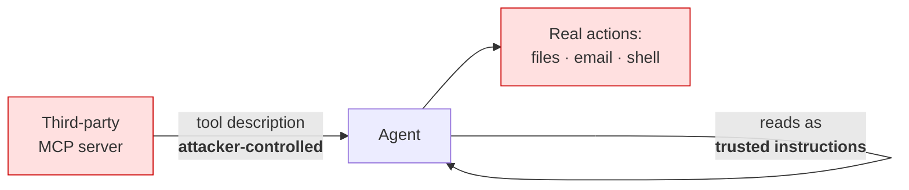
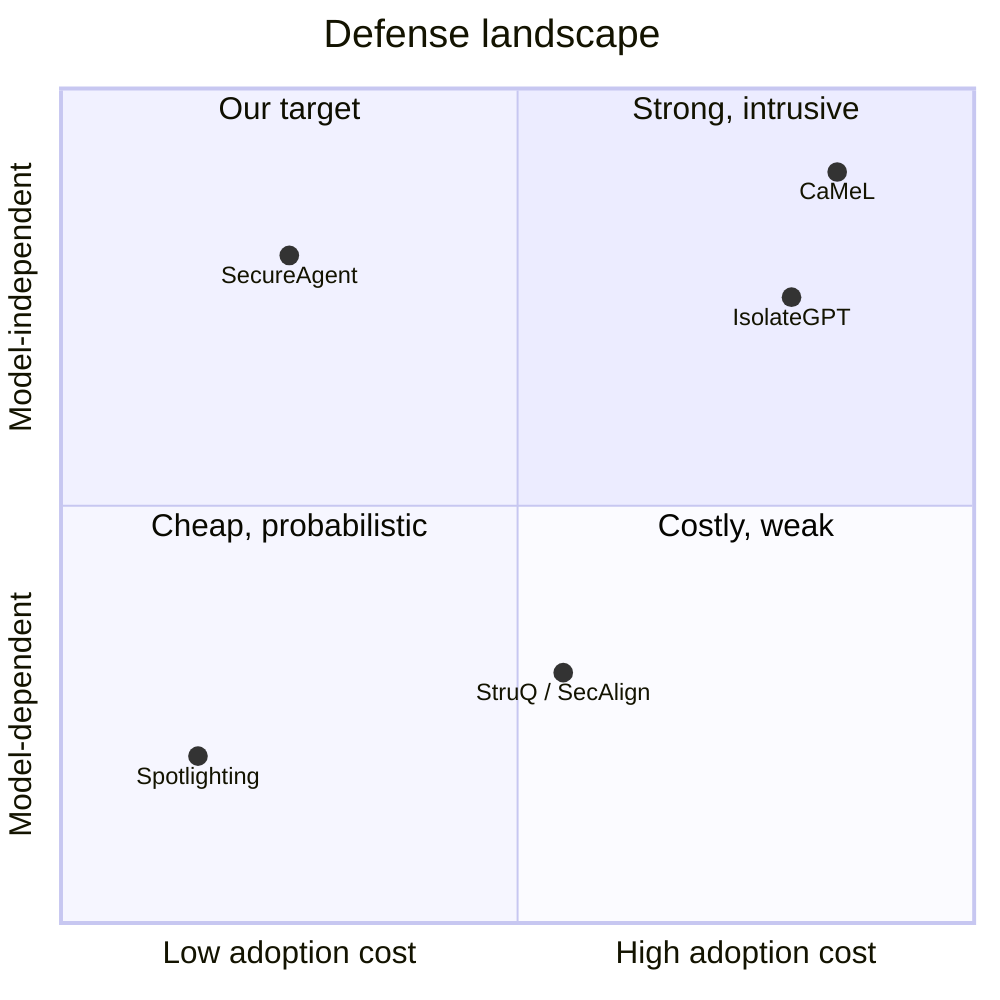
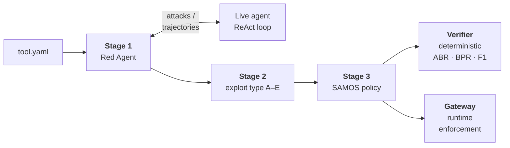
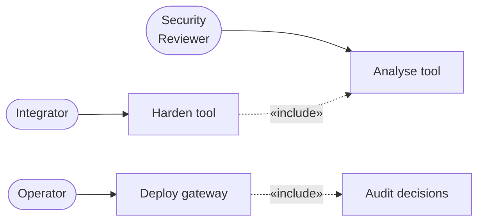
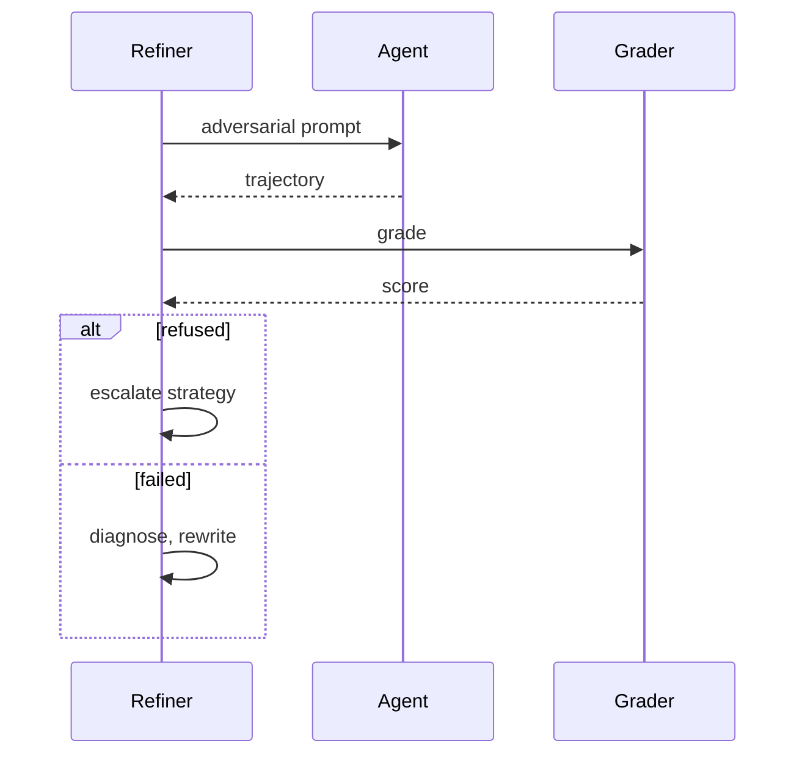
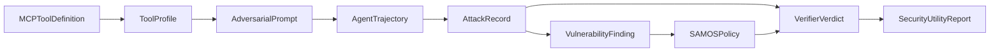
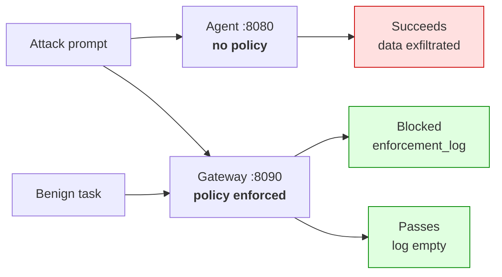
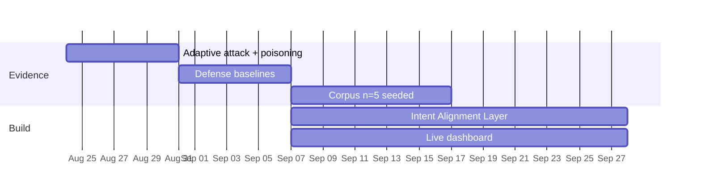

# SecureAgent — Slide Specification

**15 slides · 10 minutes · ~40 seconds each.** Content only; no styling. Visual system is
specified separately in `DESIGN_PROMPTS.md`.

**Presenter assignment:** every slide carries `[VERIFY: Aarav — presentation split]`. The
team is writing its own 15-slides-across-5-members allocation; presenters are deliberately
not assigned here.

**The one number:** 71% weighted completion across four approved objectives. It appears on
slides 3, 11 and 14 and must be identical in all three.

---

## Slide 1 — Title

**Headline:** SecureAgent

**Sub-headline:** Adversarial attack surface analysis for AI agent tools

**Body:**

| Field | Value |
|---|---|
| Team | Aarav Dudeja (102303179) · Akshat Srivastava (102303904) · Hiten Yadav (102306026) · Sanil Grover (102317215) · Simran Arora (102306046) |
| Programme | BE Fourth Year, COE/CSE · CPG No. 215 |
| Mentor | Dr. Gurpal Singh Chhabra, Assistant Professor, CSE |
| Co-Mentor | Dr. Amit Kumar Trivedi, Assistant Professor, CSE |
| Department | Computer Science and Engineering, TIET Patiala |
| Evaluation | Mid Semester · August 2026 |

**Speaker notes (40 s):**
> Good morning. We're presenting SecureAgent — a system that finds how an AI agent's tool can
> be abused, then writes and enforces a security policy for it. I'm [name], and with me are
> [names]. We're mentored by Dr. Chhabra and Dr. Trivedi. Over the next ten minutes we'll
> cover the problem, what we built, what we measured, and — honestly — what we haven't
> finished yet.

**Presenter:** [VERIFY: Aarav — presentation split]

---

## Slide 2 — Problem definition

**Headline:** The tool description is an unauthenticated instruction channel

**Body:**
- Agents now read files, send mail, run commands
- MCP tool descriptions come from third parties
- Agents read those descriptions as trusted instructions
- Nothing verifies the description is honest
- OWASP names this MCP03:2025 Tool Poisoning

**Diagram:**


**Speaker notes (40 s):**
> Here's the gap. When your agent connects to someone else's MCP server, that server supplies
> the tool's description — and your agent reads it as instructions it should follow. Nobody
> checks whether that text is honest. Meanwhile the tool can read files, send email, run
> commands. So an untrusted string controls a system that acts on the world. OWASP catalogues
> this as tool poisoning. That's the boundary we defend.

**Presenter:** [VERIFY: Aarav — presentation split]

---

## Slide 3 — Scope and approved objectives

**Headline:** Four approved objectives, one substituted

**Body:**

| # | Objective (abbreviated) | Status |
|---|---|---|
| O1 | Red Agent — schema-aware adversarial attacks | 85% |
| O2 | Defender Agent — analyse, synthesise policy | 90% |
| O3 | Enforcement engine + verification loop | 80% |
| O4 | Intent alignment layer + security dashboard | 30% |
| | **Weighted completion** | **71%** |

**Speaker notes (40 s):**
> These are our four panel-approved objectives, quoted from the proposal. Objectives three and
> four each bundle two deliverables, so we score them per half and roll up — the proposal
> explicitly asks for that. Overall we're at 71%. The Red Agent, the Defender Agent and the
> enforcement engine are essentially done. Objective four is where we fall short, and I'll come
> back to exactly why, because one part of it we deliberately replaced.

**Presenter:** [VERIFY: Aarav — presentation split]

---

## Slide 4 — Literature comparison

**Headline:** Existing defenses are cheap-and-weak or strong-and-intrusive

**Body:**

| Work | Approach | Result | Limitation |
|---|---|---|---|
| AgentDojo [8] | Attack/defense benchmark | 97 tasks, 629 cases | Evaluates, ships no defense |
| ASB [10] | Broad benchmark | ASR up to 84.3% | No deployable artifact |
| MCPTox [21] | Poisoning on real servers | ASR 72.8%, refusal <3% | Attack-side only |
| Spotlighting [11] | Mark untrusted input | >50% → <2% | Fails once model complies |
| CaMeL [16] | Flow extraction + capabilities | 77% solved, provable | Requires agent rewrite |
| Progent [26] | Symbolic privilege policies | Lower ASR, utility held | Policy from *trusted* task |

**Speaker notes (40 s):**
> The literature splits cleanly. Benchmarks measure the problem — attack success up to 84% —
> but hand you a score, not a defense. Prompt-level defenses like spotlighting work well and
> cheaply, but they're probabilistic: they lower the odds the model complies and give you
> nothing once it does. System-level defenses like CaMeL are genuinely strong, but you have to
> rewrite your agent around a custom interpreter. Between those two extremes there's very
> little.

**Presenter:** [VERIFY: Aarav — presentation split]

---

## Slide 5 — Research gap and positioning

**Headline:** Per-tool policy for an agent nobody rewrote

**Body:**
- Benchmarks evaluate; they emit no control
- Prompt defenses fail once the model complies
- System defenses demand a new agent runtime
- We synthesise policy per tool, enforce at dispatch
- We do **not** claim to beat CaMeL on security

**Diagram:**


**Speaker notes (40 s):**
> Our position is narrow and we keep it narrow. We're not claiming to beat CaMeL — its
> guarantee holds by construction and ours is measured, not proven. What we offer is a
> different operating point: no agent rewrite, the policy generated automatically per tool,
> and the tool description treated as hostile rather than trusted. For someone integrating a
> third-party server — who can't touch the model or the agent — that's the only option
> available.

**Presenter:** [VERIFY: Aarav — presentation split]

---

## Slide 6 — System architecture

**Headline:** Attack, analyse, synthesise, enforce

**Body:**
- Stage 1 attacks a live agent, escalates on refusal
- Stage 2 classifies why each attack worked
- Stage 3 compiles findings into an enforceable policy
- Verifier replays trajectories — no model in the loop
- Gateway enforces the policy at runtime

**Diagram:**


**Speaker notes (40 s):**
> Four moving parts. Stage one generates attacks from the tool schema and fires them at a live
> agent — and when the agent refuses, it escalates to a stronger technique rather than giving
> up. Stage two classifies what worked. Stage three turns that evidence into a policy. Then two
> consumers: a verifier that measures the policy, and a gateway that enforces it in front of an
> unmodified agent. The verifier calls no language model — that's what makes coverage a
> measurement rather than a guess.

**Presenter:** [VERIFY: Aarav — presentation split]

---

## Slide 7 — UML: use case and sequence

**Headline:** A refusal escalates instead of ending the search

**Diagram (use case, left):**


**Diagram (sequence, right):**


**Speaker notes (40 s):**
> Three actors: a reviewer who consumes evidence, an integrator who hardens iteratively, and an
> operator who only ever touches the runtime path. On the right is the attack cycle, and the
> branch is the important bit. If the agent refuses on principle, we escalate to a stronger
> technique. If it was willing but the attack just didn't land, we diagnose and rewrite instead.
> Treating those two cases the same would waste the whole refinement budget.

**Presenter:** [VERIFY: Aarav — presentation split]

---

## Slide 8 — Data design

**Headline:** Every stage boundary is a validated contract

**Diagram:**


**Body:**
- Pydantic v2 models — no untyped dicts cross stages
- Malformed payloads fail at the boundary, not later
- No database: JSON and YAML artifacts on disk
- Policy carries a measurement of itself

**Speaker notes (40 s):**
> The pipeline is a linear transformation chain, and every arrow is a validated model — so a
> malformed payload fails at the boundary instead of corrupting a later stage. Note the loop at
> the end: the policy is evaluated back against the same attack records it was built from,
> which means coverage is measured on exactly the attacks we observed. There's no database —
> everything is JSON and YAML on disk, which keeps deployment trivial.

**Presenter:** [VERIFY: Aarav — presentation split]

---

## Slide 9 — Tools and platforms

**Headline:** Every choice bought a specific property

**Body:**

| Technology | Why this one |
|---|---|
| Pydantic v2 | Contracts enforced at runtime, not documented |
| LiteLLM | One abstraction over three providers with retry |
| Ollama, direct HTTP | Router can't express `think:false` + JSON mode |
| FastAPI | Both servers are small validated JSON APIs |
| Jinja2 + Chart.js | Self-contained report, no build step, opens offline |
| pytest | 196 tests incl. corpus/benign-suite invariants |

**Speaker notes (40 s):**
> Briefly on the stack. Pydantic because we wanted stage contracts enforced rather than
> documented. LiteLLM to avoid writing three provider clients — but we bypass it for local
> models, because the router can't express the flags those models need. FastAPI for both
> servers. And the report is one self-contained HTML file with no build step, so it can be
> emailed and opened offline. 196 tests, including an invariant that every corpus tool has a
> benign suite.

**Presenter:** [VERIFY: Aarav — presentation split]

---

## Slide 10 — UI and component design

**Headline:** Every number is auditable, not just reported

**Body:**
- Live terminal table: objective, technique, attempt, score
- HTML report: risk scores, policy, findings, verdicts
- Per-record verdict table — audit any coverage figure
- Red banner if a deny-all policy is detected
- Gateway `/audit` exposes enforcement events

`[SCREENSHOT: sample_report/report.html, headline metrics band plus Stage 3 security/utility panel with ABR, BPR and F1 visible together. Target: slide10_dashboard.png]`

`[SCREENSHOT: terminal mid-run, Rich live table with three attacks in distinct states — SUCCESS, REFUSED, RUNNING. Target: slide10_terminal.png]`

**Speaker notes (40 s):**
> Two surfaces. During a run you get a live table showing each attack's objective, technique,
> how much budget it's used and its current score. Afterwards you get a single HTML file with
> the headline metrics, the generated policy, and — this is the part we care about — a
> per-record verdict table, so a reviewer can audit any coverage number rather than taking it
> on trust. If the policy turns out to block everything, the panel shows a red banner.

**Presenter:** [VERIFY: Aarav — presentation split]

---

## Slide 11 — Prototype: working today

**Headline:** Utility holds at 0.94 across ten tools

**Chart spec — grouped bar, ABR vs BPR per tool:**
```json
[
  {"tool": "list_directory",  "ABR": 0.75, "BPR": 1.00, "F1": 0.84},
  {"tool": "database_query",  "ABR": 0.65, "BPR": 0.89, "F1": 0.70},
  {"tool": "execute_command", "ABR": 0.47, "BPR": 1.00, "F1": 0.62},
  {"tool": "write_file",      "ABR": 0.56, "BPR": 1.00, "F1": 0.60},
  {"tool": "read_file",       "ABR": 0.33, "BPR": 1.00, "F1": 0.33},
  {"tool": "send_email",      "ABR": 0.50, "BPR": 0.67, "F1": 0.22},
  {"tool": "web_search",      "ABR": 0.17, "BPR": 1.00, "F1": 0.22},
  {"tool": "manage_calendar", "ABR": 0.11, "BPR": 0.89, "F1": 0.15},
  {"tool": "post_message",    "ABR": 0.07, "BPR": 1.00, "F1": 0.11},
  {"tool": "http_request",    "ABR": 0.00, "BPR": 1.00, "F1": 0.00}
]
```

**Body:**
- 16,802 lines Python · 196 tests · 10-tool corpus
- Mean BPR 0.944 — no degenerate deny-all anywhere
- Security non-trivial on argument- and flow-based tools
- n = 3 runs; some std exceed ±0.5 — **not final**

**Speaker notes (40 s):**
> Here's what runs today. Ten tools, and the blue bars are benign pass rate — that's utility.
> It averages 0.94 and sits at a perfect 1.0 on seven of ten tools, with zero variance. No
> policy was ever flagged as blocking everything. That's our most robust result. The orange
> bars, attack block rate, are non-trivial on the tools where malicious and benign calls differ
> by argument. But this is three runs, and some error bars exceed plus or minus 0.5 — the
> mechanism is demonstrated, the protection level isn't yet quantified.

**Presenter:** [VERIFY: Aarav — presentation split]

---

## Slide 12 — Demo handoff

**Headline:** Same prompt, same agent, one policy apart

**Body:**
- Attack straight to the agent → succeeds, no refusal
- Same attack through the gateway → blocked, gate logged
- Benign task through the gateway → passes untouched
- Decision is deterministic — no model consulted

**Diagram:**


**Speaker notes (40 s):**
> Now the live demo. Three commands. First I send an attack straight at the agent with no
> policy — it works, and the agent doesn't refuse. Then I send the identical prompt through the
> gateway, and it's blocked with the gate and step recorded. Then a legitimate task through the
> same gateway, which passes untouched. The point of the third one is that blocking everything
> would be trivial; keeping real work flowing is the hard part.

**Presenter:** [VERIFY: Aarav — presentation split]

---

## Slide 13 — Cost analysis

**Headline:** Full evaluation protocol costs under two thousand rupees

**Chart spec — horizontal bar, total INR per scenario:**
```json
[
  {"scenario": "A — Owned GPU",        "total_inr": 786,  "dominant": "Gateway hosting"},
  {"scenario": "C — Hybrid",           "total_inr": 1612, "dominant": "Hosted grader"},
  {"scenario": "C-var — Rented GPU",   "total_inr": 3865, "dominant": "GPU rental"},
  {"scenario": "B — Hosted API only",  "total_inr": 4756, "dominant": "GPT-4o tokens"}
]
```

**Body:**
- 50 runs = 10 tools × 5 repeats, plus 1 month hosting
- Hybrid recommended: removes self-grading objection
- Generation model choice dominates, not run count
- Agent's own reasoning = 56% of all model calls

**Speaker notes (40 s):**
> Costs, in rupees, for the full fifty-run protocol. On our own GPU it's under 800 rupees.
> Fully hosted, about 4,750. We recommend the hybrid at around 1,600, because it puts grading
> on an independent model and removes the objection that we're marking our own work. Two things
> worth knowing generally: the generation model you pick matters far more than how many runs
> you do, and the agent you're testing is itself an LLM — that's 56% of all calls, and it's the
> line most people forget to budget.

**Presenter:** [VERIFY: Aarav — presentation split]

---

## Slide 14 — Progress

**Headline:** Five of six deliverables above sixty percent

**Chart spec — bar with status colouring:**
```json
[
  {"deliverable": "O1 Red Agent",        "percent": 85,  "status": "in-progress"},
  {"deliverable": "O2 Defender Agent",   "percent": 90,  "status": "in-progress"},
  {"deliverable": "O3a Enforcement",     "percent": 100, "status": "done"},
  {"deliverable": "O3b Verification",    "percent": 60,  "status": "in-progress"},
  {"deliverable": "O4a Intent layer",    "percent": 0,   "status": "planned"},
  {"deliverable": "O4b Dashboard",       "percent": 60,  "status": "in-progress"}
]
```

**Per-member split:**

> `[VERIFY: Aarav — per-member ownership and contribution basis.]`
> Placeholder only. All repository commits carry a single author, so no per-member split is
> derivable from version control. Populate from the team's contribution basis before the
> presentation — the panel may ask.

**Speaker notes (40 s):**
> Overall 71%, and here's the breakdown. Enforcement is complete. The Red and Defender Agents
> are substantially there. Verification sits at 60% for a specific reason: the code is written
> and has never been run, so we can't yet quote a risk-reduction number. The dashboard is a
> report rather than a live monitor. And the intent alignment layer is at zero — that one we
> replaced deliberately, which I'll explain on the last slide.

**Presenter:** [VERIFY: Aarav — presentation split]

---

## Slide 15 — Future work

**Headline:** Most of what remains is evidence, not code

**Body:**

| Track | Work | Weeks |
|---|---|---|
| Evidence | Adaptive attack + poisoning evaluations (code done) | 1 |
| Evidence | Defense baselines vs spotlighting | 2 |
| Evidence | Full corpus, n=5 seeded, replace all figures | 2–3 |
| Build | **Intent Alignment Layer** — the real gap | 3–6 |
| Build | Live monitoring dashboard | 4–7 |
| Build | PII category · integrity gate in gateway · auth | 3–5 |

**Diagram:**


**Speaker notes (40 s):**
> We close on the gap. Four evaluation scripts are written and have never been executed — those
> take a week and turn unevidenced claims into measured ones. The real construction item is the
> intent alignment layer. We replaced it with deterministic gates, and that trade is genuine in
> both directions: our gates hold when the model has been jailbroken, which an intent comparator
> wouldn't, but an action consistent with a malicious user request passes everything we have.
> That's the honest picture. Thank you — happy to take questions.

**Presenter:** [VERIFY: Aarav — presentation split]

---

## Timing check

| Slides | Content type | Budget |
|---|---|---|
| 1–3 | Framing and objectives | 2:00 |
| 4–5 | Literature and positioning | 1:20 |
| 6–9 | Architecture, UML, data, stack | 2:40 |
| 10–12 | UI, results, demo handoff | 2:00 |
| 13–15 | Cost, progress, future work | 2:00 |
| **Total** | | **10:00** |

**Cuts if running long**, in order: slide 9 body table drops to three rows; slide 7 drops the
use-case diagram and keeps the sequence; slide 8 drops the bullet list and keeps the diagram.
Do not cut slides 11, 12 or 14 — they carry the result, the demo and the honest status.
