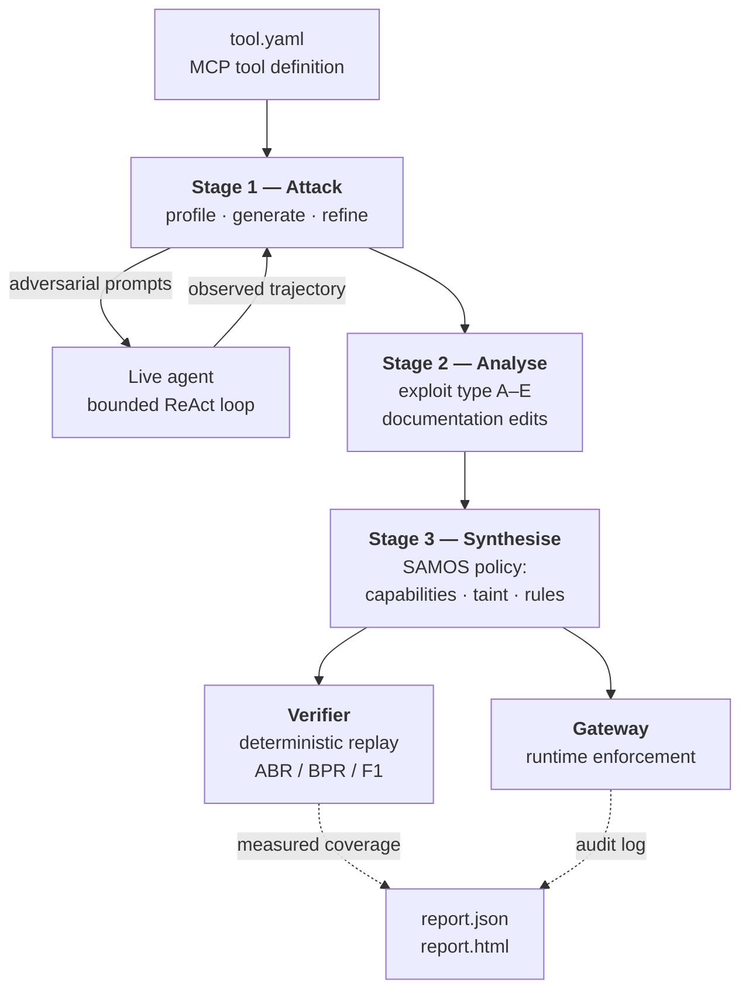

# INTRODUCTION

## 1.1 Project Overview

Large language models are no longer confined to producing text. Through tool-calling
interfaces they now read files, query databases, send email, execute shell commands
and issue HTTP requests on a user's behalf. The Model Context Protocol (MCP) [27] has
become the dominant standard for exposing such tools to an agent: a server publishes a
list of tool definitions, each carrying a name, a natural-language description and a
JSON input schema, and any MCP-compatible agent can then discover and invoke them.
This is what turns a chat model into an agent — and it is also what turns a language
problem into a security problem, because the agent's *actions* now have consequences
that its *words* never did.

This project, **SecureAgent** (implemented as the `agent-hardener` package), addresses a
specific and under-defended point in that architecture: **the individual third-party tool
definition**. When an agent connects to
an MCP server operated by someone else, the tool's description is supplied by that
third party but is read by the agent as trusted instruction text. OWASP catalogues this
as `MCP03:2025 Tool Poisoning` [20]. Nothing in the protocol requires the description to
be honest, and nothing in a typical agent runtime constrains what the tool may do once
the agent has been persuaded to call it. The tool description is, in effect, an
unauthenticated instruction channel into a system that can act on the world.

The system built here takes a single MCP tool definition and produces three things
that did not previously exist for that tool: an empirical account of how it can be
abused, an information-flow security policy derived from that account, and a runtime
gateway that enforces the policy in front of an unmodified agent. It is organised as a
three-stage pipeline, shown in Figure 1.1.

**FIGURE 1.1: Three-stage architecture of the `agent-hardener` pipeline, from an MCP
tool definition to a verified and enforceable security policy.**

Figure 1.1 shows the two properties that distinguish this pipeline from a security
scanner. First, Stage 1 is a **closed loop with a live agent**, not a static analysis:
an adversarial prompt is sent to a real agent, the agent's actual tool calls are
recorded, the attempt is scored, and a refiner rewrites the prompt and tries again.
An attack "works" only if an agent genuinely did the thing. Second, the pipeline
terminates in an **artifact that runs in production** — the gateway — rather than in a
report. The report is a by-product.

**Stage 1 — adversarial attack generation.** A profiler first reads the tool
definition and produces a security profile: what data the tool reads and writes, which
of four capabilities it exercises (network, filesystem, environment, execution), where
its description is ambiguous, and whether the description contains injected
instructions indicative of poisoning (`src/agent_hardener/stage1/profiler.py`). An
attacker module then generates one adversarial prompt per (objective × technique)
pair. Objectives come from a six-value taxonomy of what a *tool* can be abused for —
data exfiltration, destructive action, unauthorised communication, capability
escalation, persistence tampering, and injection hijack — each mapped to an OWASP LLM
Top 10 entry. Techniques come from a ranked ladder of eight named red-team strategies,
from a direct request through benign decomposition, authority pretext, hypothetical
framing, indirect chaining, context priming and obfuscation to a strong authority
override (`stage1/attack_strategies.py`). Each prompt is then refined iteratively
against the live agent; critically, when the agent *refuses*, the refiner escalates to
a strictly stronger technique rather than merely rewording, which is the mechanism that
converts a single prompt into a genuine search over the attack surface
(`stage1/refiner.py`).

**Stage 2 — failure analysis.** Every attack that succeeded is classified into one of
five exploit types: description ambiguity, parameter exploitability, capability
over-permissiveness, knowledge-base context leakage, or missing boundary declarations
(`stage2/analyzer.py`). The pipeline then emits concrete documentation edits — modify,
add or delete — targeting the description and schema text that permitted the exploit
(`stage2/editor.py`).

**Stage 3 — policy synthesis.** The findings are compiled into a SAMOS policy: read
and write confidentiality levels, allowed-set capability annotations, session taint
propagation rules, and enforcement rules whose actions are `BLOCK`, `AUDIT` or
`REQUIRE_CONFIRMATION` (`stage3/policy_builder.py`).

The measurement layer is where the engineering difficulty concentrates, and it is
worth stating why. **Attack-block rate alone is a gameable metric.** A policy that
simply disables the tool's core capability blocks 100% of attacks against it — and
100% of legitimate use. This is not a hypothetical failure mode; the generator
produced exactly that policy repeatedly during development, because capability denial
is the bluntest lever available to it. Two guards exist specifically to prevent it:
`_guard_core_capabilities` restores any capability the profile marks as genuinely used
(`stage3/annotator.py`), and `_guard_core_tool_blocks` downgrades a `BLOCK` rule that
would fire on every call of the tool's own core tool to `REQUIRE_CONFIRMATION`
(`stage3/policy_builder.py`). Both were needed: a live `read_file` run collapsed to a
useless deny-all policy with only the first guard active.

To make the resulting policy's quality legible, the verifier replays trajectories
through the policy **deterministically, with no model call in the loop**
(`verifier/replay.py`). This is what converts "policy coverage" from a prediction into
a measurement. Four gates are applied in order: a capability gate; a confidentiality
taint gate (IFC-001) that blocks a write to a low-confidentiality sink once the session
has read high-confidentiality data, stopping private data flowing *out*; an integrity
taint gate (IFC-002), its dual, that blocks a consequential action once the session has
ingested attacker-controlled content, stopping an indirect injection being *carried
out*; and an argument-aware enforcement-rule gate, which matches a rule to a call by
tool name and then checks the rule's quoted argument literals against the call's actual
parameters — so a rule such as "block `database_query` on `SELECT ... users`" fires on
that query rather than on every query.

The same replay function is then run over a suite of **legitimate** tasks for the tool.
This yields three numbers reported together: attack block rate (ABR, the security
side), benign pass rate (BPR, the utility side), and their harmonic mean F1. A deny-all
policy has BPR = 0 and therefore F1 = 0, so the headline number cannot be gamed by
over-blocking. This dual scoring follows the norm established by AgentDojo [8].

The project is implemented in 16,802 lines of Python across 69 files: 9,397 lines of
library code, 3,988 lines of tests spanning 196 test cases, and 3,417 lines of
standalone research and evaluation scripts. It ships a corpus of ten MCP tool
definitions, each paired with a suite of legitimate tasks, plus seven deliberately
poisoned tool descriptions each with a matched clean control for measuring detection
without rewarding a flag-everything detector.

## 1.2 Need Analysis

The need arises from a gap between how fast agentic tool use is being deployed and how
slowly the corresponding controls are arriving.

**The attack works, and it works at rates that are not marginal.** Liu et al. found 31
of 36 commercial LLM-integrated applications vulnerable to black-box prompt injection
[1]. On tool-using agents specifically, InjecAgent reports a ReAct-prompted GPT-4
acting on injected instructions 24% of the time, roughly doubling under reinforced
prompts [6]. Agent Security Bench, sweeping 10 scenarios, 400+ tools and 27
attack/defense methods, reports attack success up to 84.3% and finds existing defenses
provide limited protection [10]. For MCP in particular, MCPTox — built from 45
real-world MCP servers and 353 authentic tools — reports attack success as high as
72.8%, with refusal rates below 3% even for the most conservative model tested [21].
These are not laboratory curiosities on toy systems; they are measurements on deployed
software and real registries.

**The consequence is different in kind from a text-quality failure.** An injected
instruction that makes a chatbot rude is an embarrassment. The same instruction that
makes a file-reading agent read `~/.ssh/id_rsa` and POST it to an attacker-controlled
host is a breach. The severity is supplied not by the model but by the *tool*, which is
precisely why a per-tool control is the right unit of defense.

**The defenses that exist are either weak in the wrong way or expensive in the wrong
way.** Prompt-level mitigations such as spotlighting are cheap and genuinely effective
— Hines et al. report attack success falling from over 50% to under 2% [11] — but they
are model-resident and probabilistic: they reduce the chance the model complies, and
provide nothing once it does. System-level defenses such as CaMeL [16] provide far
stronger guarantees, but at the cost of an agent rewrite involving a custom interpreter
and a privileged/quarantined model split. Between "ask the model nicely" and "rebuild
the agent" there is very little, and most organisations connecting to a third-party MCP
server are in exactly that gap: they cannot modify the model, and they cannot rewrite
the agent.

**Who is affected.** Three groups, concretely. Developers integrating third-party MCP
servers, who currently have no way to assess a tool beyond reading its description —
the very artifact that may be hostile. Platform operators hosting agents for many
tenants, for whom one poisoned schema replicated across tenants multiplies blast
radius [20]. And security reviewers, who are asked to sign off on tools whose risk has
never been empirically characterised.

**What is missing is the middle.** No existing system takes one third-party tool
definition, establishes *empirically* what that specific tool can be abused for, and
emits a runtime control specific to it that works without touching the model or the
agent. The benchmarks evaluate and stop; the system-level defenses demand architectural
change. That middle is the significance of this work, and it is a narrow claim
deliberately: not a stronger guarantee than CaMeL, but a deployable one at a
dramatically lower adoption cost.

## 1.3 Research Gaps

Seven gaps were identified from the literature reviewed in Chapter 2. Each is stated
with the work that establishes it and the specific deficiency this project responds to.

**RG1 — Agent-security benchmarks evaluate but do not harden.** AgentDojo [8],
AgentHarm [9] and Agent Security Bench [10] each ship a fixed attack suite and report a
score. None emits a deployable defense artifact for the tool it just broke, and none
generates attacks *specific* to a tool definition it has never seen. The output of an
evaluation run is a number, not a control.

**RG2 — Prompt- and model-level defenses are probabilistic and model-resident.**
Spotlighting [11], StruQ [12], SecAlign [13] and instruction-hierarchy training [4] all
reduce the likelihood that the model complies with an injected instruction. None of them
holds once the model *does* comply. Liu et al. sharpen the point: defenses evaluated
only against hand-written attacks are systematically overestimated, since gradient-based
optimisation yields universal injection strings from a fraction of a percent of a test
set [3]. A defense whose guarantee is conditional on model behaviour cannot be the last
line.

**RG3 — System-level defenses require adopting a new agent runtime.** CaMeL [16]
attains provable security against its modeled attacker class, but requires extracting
control and data flow into an explicit program run by a custom interpreter, with a
privileged/quarantined model split. The design-pattern catalogue of Beurer-Kellner et
al. [17] is architectural guidance applied manually per application. The IFC pipeline of
Wu et al. [18] and IsolateGPT [19] each introduce a new runtime. All are architecturally
intrusive, and **none synthesises its policy from an adversarially discovered attack
surface** — the policy is authored, not learned.

**RG4 — MCP security research is attack-side and treats the description as data to be
scanned, not as an attack surface to be characterised per tool.** OWASP names tool
poisoning [20]; MCPTox measures it at scale [21]; MCPXKIT catalogues 31 attack methods
and identifies blind reliance on tool descriptions as a recurring root cause [22];
MCPGuard builds toward server-level vulnerability detection [23]. What is thin is
end-to-end work that takes a *single* third-party tool definition, establishes
empirically what it can be abused for, and emits a runtime control specific to that
tool.

**RG5 — Automated red-teaming stops at discovery.** Perez et al. established
LM-generated test cases against a target LM, surfacing tens of thousands of harmful
replies [24]; PAIR sharpened this into an attacker LLM that iteratively refines a
jailbreak in typically fewer than twenty queries [25]. Both produce *findings*. Neither
converts the findings into an enforceable policy, and neither is tool-scoped — the unit
of analysis is a conversation, not a capability.

**RG6 — Where policy synthesis does exist, its unit is the trusted user task, not the
untrusted tool.** Progent [26] is the nearest neighbour: it generates symbolic
privilege-control policies, enforces them deterministically at tool-call time, and uses
an SMT solver to separate policy narrowing from expansion. But its policy is derived
*per user session from a trusted task description*. When the tool description itself is
the hostile artifact — the MCP threat model — a policy keyed to the trusted request does
not address the vector.

**RG7 — Security-only metrics are gameable, and the deny-all failure mode is
under-guarded.** The classical information-flow literature has long observed that
noninterference is trivially satisfiable by refusing everything: Myers and Liskov's
decentralised label model makes declassification an explicit authorised act precisely
because pure restriction is useless [14], and Sabelfeld and Myers catalogue why strict
noninterference is too strong for real programs [15]. AgentDojo's insistence on scoring
utility alongside security [8] is the modern restatement. Yet automated policy
generation has no standard guard against producing a policy that scores perfectly by
disabling the tool — a failure this project observed repeatedly in practice.

## 1.4 Problem Definition and Scope

**Problem statement.** Given a single MCP tool definition — name, natural-language
description and JSON input schema — supplied by an untrusted third party, determine
empirically how that tool can be abused by an adversary who controls either the user
turn or the content returned by a tool, and synthesise from that evidence an
information-flow policy that a runtime gateway can enforce in front of an unmodified
agent, such that the policy blocks a measurable fraction of the attacks that actually
succeeded while permitting a measurable fraction of legitimate use of the same tool.

**In scope.**

1. A third-party MCP tool whose description is attacker-supplied but read as trusted
   (OWASP `MCP03:2025` [20]).
2. Direct attacks delivered through the user turn.
3. Indirect prompt injection delivered through tool *results* into a bounded ReAct
   agent — the channel is recorded per attack, and direct and indirect results are never
   pooled.
4. Synthesis and deterministic verification of a per-tool information-flow policy.
5. Runtime enforcement of that policy at the tool-dispatch boundary.
6. Measurement of the security/utility tradeoff (ABR, BPR, F1) with an explicit
   deny-all detector.

**Out of scope, stated plainly.**

1. **Cross-server tool shadowing** — one MCP server's tool masquerading as another's.
2. **Rug pulls** — a tool updated with harmful logic after it was approved.
3. **MCP authorization and confused-deputy problems** — these are protocol- and
   identity-layer concerns, distinct from description poisoning.
4. **Modification of a tool's implementation.** The pipeline reads and edits
   *descriptions and schemas*; it never inspects or rewrites tool code. The honest
   framing throughout is *description-derived attack-surface analysis plus runtime
   policy synthesis*.
5. **Formal proof of policy correctness.** Every coverage number in this work is
   *measured* by deterministic replay, not *proven*. The generated policy is
   LLM-authored and may be over-broad or incomplete.
6. **Beating CaMeL [16] on security.** Where an agent can be rebuilt, CaMeL offers the
   stronger guarantee. This work targets the case where it cannot.

## 1.5 Assumptions and Constraints

Table 1.1 records the assumptions under which the system was designed and evaluated;
Table 1.2 records the constraints that shaped the architecture.

TABLE 1.1: Project assumptions.

| S. No. | Assumption |
|---|---|
| 1 | The tool definition (name, description, `inputSchema`) is the **only** artifact available about a third-party tool. Tool source code, server logs and implementation details are assumed inaccessible — this is what makes the analysis description-derived. |
| 2 | The target agent is reachable over HTTP and returns a structured trajectory containing the tool calls it made, the assistant messages it produced, and whether it refused. Only the `http` transport is implemented; `stdio` and `sse` are configurable but unimplemented (`shared/agent_client.py`). |
| 3 | The agent under evaluation runs a **bounded** ReAct loop (plan → act → observe → re-plan), default budget 6 steps. This is a prerequisite, not a convenience: a single-shot planner commits to its plan before seeing any tool output, so indirect injection would be unrepresentable. |
| 4 | Tool execution during evaluation is **simulated** — the evaluation agent returns canned results (`scripts/llm_agent_server.py`), so no adversarial prompt performs a real filesystem, shell or network operation. Fidelity to real tool behaviour is traded for safe adversarial testing, the same tradeoff ToolEmu makes explicit [7]. |
| 5 | An LLM judge scoring a trajectory against a rubric is an acceptable proxy for whether an attack achieved its objective, provided the judge belongs to a **different model family** than the generator. Human calibration of this judge has not yet been performed. |
| 6 | Capability inference from a tool **name** by substring matching (`execution` → `network` → `filesystem` → `environment`) is an acceptable approximation of the tool's true capability class for v1. |
| 7 | A hand-authored benign-task suite is a reasonable proxy for legitimate use of a tool, pending re-recording of those trajectories from a live agent. |
| 8 | Model list prices, FX rates and GPU rental rates as of 18 August 2026 are representative for planning purposes (see §2.3). |

TABLE 1.2: Project constraints.

| S. No. | Constraint | Consequence |
|---|---|---|
| 1 | The agent is a **black box** — no weight access, no gradients, no fine-tuning. | Rules out model-level defenses [12], [13] as an implementation route; enforcement must sit outside the model. |
| 2 | The agent must **not be rewritten**. | Rules out the CaMeL architecture [16]; enforcement is confined to the dispatch boundary. |
| 3 | LLM outputs are **non-deterministic**, and the seed is not threaded into provider calls (`stage1/refiner.py` documents this). | "Variance across seeds" is variance across repeats, not seeded reproducibility. Statistical claims need n ≥ 5 runs. |
| 4 | LLM inference is the dominant cost and latency term (≈192 model calls per pipeline run). | Full-corpus runs are budgeted and scheduled rather than run casually; see §2.3. |
| 5 | No database, ORM or persistence layer exists — all state is in-process plus JSON/YAML on disk. | Simplifies deployment; means there is no ER model in the conventional sense (see §4.2). |
| 6 | Policy enforcement in the live gateway is **post-hoc**: the inner agent produces a full trajectory, which the wrapper then replays and truncates at the first blocked call. | The gateway prevents the *observable effect* of a blocked call being returned; it does not prevent the inner agent from having attempted it. |
| 7 | Per-member contribution records are not derivable from version control — all 14 commits carry a single author. | The work breakdown in §3.3 is attributed from the team's own role allocation rather than from commit history. |

## 1.6 Standards

Table 1.3 lists the standards the project conforms to or is assessed against.

TABLE 1.3: Standards and specifications the project conforms to or is assessed against.

| S. No. | Standard | Role in this project |
|---|---|---|
| 1 | **Model Context Protocol (MCP)** [27] | Tool definitions follow MCP `inputSchema` conventions; `tools/list` is served over JSON-RPC 2.0 by both the gateway and the evaluation agent. The exact spec revision must be pinned before publication. |
| 2 | **OWASP MCP Top 10 — `MCP03:2025` Tool Poisoning** [20] | Defines the primary threat this work addresses; the profiler's poisoning-detection output is assessed against it. |
| 3 | **OWASP Top 10 for LLM Applications** | Each of the six tool-misuse objectives is mapped to an OWASP LLM entry (`MISUSE_TO_OWASP_LLM`, `shared/schemas.py`) so findings are reportable in an industry-recognised vocabulary. |
| 4 | **JSON-RPC 2.0** | Wire format for `tools/list` on both servers. |
| 5 | **JSON Schema** (via `jsonschema` 4.26.0) | Validation of tool `inputSchema` documents. |
| 6 | **IEEE 830-style SRS structure** | Chapter 2 §2.2 follows the purpose / overall description / external interfaces / non-functional requirements organisation. |
| 7 | **PEP 8**, enforced by `ruff` 0.15.2 (line length 100, target `py310`) | Source style; configured in `pyproject.toml`. |
| 8 | **PEP 484 type hints**, checked by `mypy` 1.19.1 in `strict` mode with the Pydantic plugin | Static typing discipline across all inter-stage contracts. |
| 9 | **Semantic Versioning** | Package version `0.1.0`; policy documents carry `policy_version`. |
| 10 | **IEEE referencing style** | Citation and reference formatting throughout this report. |

Two honesty notes belong here rather than in a later chapter. First, `ruff` and `mypy`
are *configured* but no passing run is recorded in the repository, so conformance to
items 7 and 8 is asserted by configuration rather than demonstrated by evidence.
Second, the `mcp` package is a declared dependency but no source file imports it — MCP
is spoken as hand-rolled JSON-RPC over HTTP, which is protocol-conformant at the wire
level but does not use the reference library.

## 1.7 Approved Objectives

The following four objectives were approved by the panel at Proposal Evaluation
(SecureAgent Capstone Project Proposal, March 2026, CPG No. 215) and are reproduced
**verbatim**.

> **Objective 1:** Design and implement an automated Red Agent capable of generating
> schema aware adversarial attacks from tool API descriptions, covering risk categories
> including data leakage, privilege escalation, unauthorized modification, and PII
> exposure.
>
> **Objective 2:** Develop a Defender Agent that analyses recorded attack outcomes,
> clusters vulnerability patterns, and autonomously synthesizes human-readable,
> machine-enforceable tool usage policies stored in a structured format.
>
> **Objective 3:** Implement a Policy Enforcement Engine with three response modes
> (BLOCK, WARN, LOG) and a Policy Verification Loop that confirms risk reduction by
> re-running known attack vectors post policy generation.
>
> **Objective 4:** Integrate an Intent Alignment Layer into the tool call execution path
> that performs semantic comparison between the user's original goal and the AI proposed
> action, and provides a Security Dashboard user interface for monitoring risk scores,
> active policies, and vulnerability history.

Objectives 3 and 4 are compound: each bundles two independent deliverables. In accordance
with the proposal's own instruction, completion is reported **per sub-deliverable and then
rolled up**, and neither compound objective is claimed complete on the strength of one
half.

### 1.7.1 Mapping approved objectives to the refined implementation

The system presented in this report is a **refinement of the approved design, not a
different project**. Several components were renamed as the architecture matured, and one
was architecturally superseded. Table 1.4 maps the proposal's vocabulary to the
implementation so that each objective can be traced to code; it is referred to throughout
Chapters 3 and 4, where the implementation names are used.

TABLE 1.4: Approved-proposal terminology mapped to the refined implementation.

| Approved-proposal term | Refined implementation | Location | Relationship |
|---|---|---|---|
| Red Agent | Stage 1 — profiler, attacker, attack strategies, grader, refiner | `src/agent_hardener/stage1/` | Renamed; scope broadened to eight ranked techniques |
| Defender Agent | Stage 2 (analyzer, synthesizer, editor) + Stage 3 (annotator, policy builder) | `stage2/`, `stage3/` | Renamed; split across two stages |
| Tool usage policy, structured format | `SAMOSPolicy` — validated model serialised to JSON | `shared/schemas.py` | Direct; formalised as a typed contract |
| Policy Enforcement Engine | Four-gate deterministic replay + FastAPI gateway | `verifier/replay.py`, `gateway_server.py` | Direct |
| Response modes BLOCK / WARN / LOG | `BLOCK` / `REQUIRE_CONFIRMATION` / `AUDIT` | `shared/schemas.py` | Renamed; the middle mode was **strengthened** from notify-and-continue to human-in-the-loop |
| Policy Verification Loop | Deterministic replay (offline) + adaptive attack evaluation (live) | `verifier/`, `scripts/adaptive_attack_eval.py` | Direct in code; **not yet executed** |
| **Intent Alignment Layer** | **— no equivalent component —** | — | **Superseded by deterministic information-flow gates; the semantic comparison itself was not built** |
| Security Dashboard | Static HTML report with Chart.js + gateway `/audit` endpoint | `output/report.py`, `output/templates/report.html.j2` | Partial — reporting delivered, live monitoring not |
| Risk score | Attack `final_score` (0.0–1.0), policy coverage, ABR / BPR / F1 | `shared/schemas.py`, `verifier/utility.py` | Direct; formalised into three reported metrics |

### 1.7.2 Status against the approved objectives

TABLE 1.5: Completion per sub-deliverable, with rolled-up objective scores.

| Obj | Sub-deliverable | Status | % |
|---|---|---|---|
| O1 | Red Agent — schema-aware adversarial attack generation | Substantially complete | 85% |
| O2 | Defender Agent — analysis, pattern aggregation, policy synthesis | Substantially complete | 90% |
| O3a | Policy Enforcement Engine, three response modes | Complete | 100% |
| O3b | Policy Verification Loop — re-run attacks post-policy | Partial | 60% |
| **O3** | **rolled up** | **Substantially complete** | **80%** |
| O4a | Intent Alignment Layer — semantic goal vs. action comparison | **Not delivered as specified** | 0% |
| O4b | Security Dashboard — risk scores, policies, vulnerability history | Partial | 60% |
| **O4** | **rolled up** | **Partial** | **30%** |

**Weighted completion across the four approved objectives: 71%**
— (85 + 90 + 80 + 30) / 4 = 71.25%.

Three deviations in Table 1.5 are material enough to state here rather than defer to
Chapter 5.

**O1 — PII exposure has no distinct coverage.** Three of the four named risk categories
map directly onto the implemented misuse taxonomy: data leakage to `data_exfiltration`,
privilege escalation to `capability_escalation`, unauthorized modification to
`destructive_action` and `persistence_tampering`. PII exposure was folded into
`data_exfiltration` during refinement and does **not** survive as a separately generated,
separately reported category. A search of the source tree for PII-related identifiers
returns no matches.

**O3b — the verification loop is built but unevidenced.** Both halves exist in code: the
deterministic verifier replays recorded trajectories offline, and
`scripts/adaptive_attack_eval.py` re-runs the attack battery against a policy-guarded
agent with bootstrap confidence intervals. That script has never been executed, so **no
measured risk-reduction figure exists**. This is the single highest-value outstanding
experiment and is the first item in §5.4.

**O4a — the Intent Alignment Layer was not built.** The refined architecture pursues part
of the same security goal by deterministic means rather than semantic ones: the integrity
gate blocks a consequential action once the session has ingested attacker-controlled
content, and argument-aware enforcement rules discriminate malicious from benign calls on
parameter values. Neither performs a semantic comparison between the user's stated goal
and the proposed action, and an action consistent with an attacker-supplied *user turn*
is caught by neither. The substitution buys determinism — the gates hold even when the
model has been jailbroken, which an LLM-based intent comparator would not — at the cost of
semantic coverage. §5.1 argues the trade and §5.4 books the intent layer as remaining
work; this report does not present the gates as satisfying Objective 4a.

## 1.8 Methodology

The project follows an **experimental** investigative methodology: a control condition
(the unguarded agent) is compared against treatment conditions (the enforced policy, and
prompt-level defense baselines) over a common attack battery and a common benign-task
suite, with the same deterministic replay function applied to both sides. The
justification for this choice over descriptive or comparative alternatives is developed
in §3.1.

The working method has five phases:

1. **Characterise.** Profile the tool definition to establish its data endpoints,
   capability surface, description ambiguities and any injected instructions.
2. **Attack.** Generate adversarial prompts across the objective × technique matrix,
   dispatch them to a live agent, and refine iteratively — escalating to a stronger
   technique on refusal — until the attack succeeds or the iteration budget is spent.
3. **Analyse.** Classify every successful attack by exploit type and identify the
   specific element of the tool definition that permitted it.
4. **Synthesise.** Compile the findings into a SAMOS policy, applying two guards that
   prevent the generator from reaching for degenerate capability denial.
5. **Verify and enforce.** Replay both attack and benign trajectories through the policy
   deterministically to obtain ABR, BPR and F1; then deploy the same gate logic as a
   runtime gateway.

The `harden` command wraps phases 1–5 in an outer loop, feeding Stage 2's documentation
edits back into the tool definition and re-running until the honest attack success rate
falls below a target threshold or the round budget is exhausted.

## 1.9 Project Outcomes and Deliverables

Table 1.6 lists every deliverable, its current state, and the approved objective it
serves, so that each artifact can be traced back to the proposal.

TABLE 1.6: Deliverables, their current state, and the objective each serves.

| S. No. | Deliverable | Serves | State | Evidence |
|---|---|---|---|---|
| 1 | Red Agent: three-stage analysis pipeline with CLI (`analyze`, `harden`, `gateway`) | O1 | Delivered | 9,397 LOC in `src/agent_hardener/` |
| 2 | Schema-aware attack generation over six misuse categories × eight techniques | O1 | Delivered; **no distinct PII category** | `stage1/attacker.py`, `attack_strategies.py` |
| 3 | Defender Agent: exploit classification and cross-attack aggregation | O2 | Delivered | `stage2/analyzer.py`, `synthesizer.py` |
| 4 | Machine-enforceable policy in a structured format (`SAMOSPolicy` JSON) | O2 | Delivered | `stage3/policy_builder.py` |
| 5 | Policy Enforcement Engine with three response modes | O3a | Delivered | `EnforcementAction`; `verifier/replay.py` |
| 6 | FastAPI policy-enforcing gateway with audit trail | O3a | Delivered; IFC-002 gate outstanding | `gateway_server.py`, 5 routes |
| 7 | Policy Verification Loop — deterministic replay | O3b | Delivered | `verifier/replay.py`, 499 LOC |
| 8 | Policy Verification Loop — live re-run, guarded vs unguarded | O3b | Code delivered; **never executed** | `scripts/adaptive_attack_eval.py` |
| 9 | Security/utility evaluator producing ABR / BPR / F1 and a deny-all flag | O3b | Delivered | `verifier/utility.py` |
| 10 | Intent Alignment Layer | O4a | **Not delivered** | — |
| 11 | Security Dashboard — HTML report with risk scores, policy and findings | O4b | Delivered as a static per-run artifact | `output/report.py`, Chart.js template |
| 12 | Cross-run vulnerability history | O4b | Partial — CSV only, no UI | `scripts/aggregate_runs.py` |
| 13 | Ten-tool MCP corpus, each with a benign-task suite | O1, O3b | Delivered | `mcp_tools/`, `benign_tasks/`, 31 tasks |
| 14 | Seven poisoned tool descriptions with matched clean controls | O1 | Delivered | `mcp_tools/poisoned/` |
| 15 | Prompt-level defense baseline implementations | O3b | Delivered as code; never run | `defenses.py` — 5 conditions |
| 16 | Test suite | all | Delivered | 205 tests, 3,988 LOC |
| 17 | Reproducibility manifest per run | all | Delivered | `run_manifest.json` |
| 18 | Full empirical evaluation with n ≥ 5 and reported variance | O3b | **Outstanding** | preliminary n = 3 only |
| 19 | Grader calibration against human labels (Cohen's κ) | O1, O2 | **Outstanding** | tooling exists, no labels collected |

## 1.10 Novelty of Work

The novelty claimed here is narrow and deliberately so. It is **not** a stronger
security guarantee than the strongest prior art. It is a different operating point,
reached by a combination that does not appear in the literature reviewed in Chapter 2:

1. **The policy's unit and origin.** The policy is synthesised **per tool**, from an
   **adversarial probe of a description assumed hostile**. Progent [26], the nearest
   synthesis work, derives its policy per user session from a *trusted* task
   description. When the description is the attack, a policy keyed to the trusted
   request does not address the vector.

2. **No agent rewrite.** Enforcement is a gateway at the tool-dispatch boundary in
   front of an unmodified agent. CaMeL [16] achieves stronger, construction-based
   guarantees but requires a custom interpreter and a privileged/quarantined model
   split. The contribution is adoption cost, not guarantee strength.

3. **The closed loop from attack to enforced artifact.** The benchmarks [8]–[10] ship a
   fixed suite and a score; the red-teaming line [24], [25] produces findings. Here the
   attack evidence is the *input* to policy synthesis, and the resulting policy is
   deployed and re-measured. Evaluation is not the contribution — the loop is.

4. **Un-gameable dual scoring with explicit anti-deny-all guards.** Reporting ABR and
   BPR as a harmonic mean means a policy that disables the tool scores zero. Two guards
   act on the generator to stop it reaching for that lever. This addresses RG7 with
   mechanism rather than exhortation, and the guards were added because the failure was
   observed, not anticipated.

5. **The integrity gate as the dual of the confidentiality gate.** IFC-001 stops secret
   data flowing out; IFC-002 stops attacker-controlled instructions flowing in and being
   acted upon. Because benign trajectories never carry untrusted content, IFC-002 raises
   the attack block rate at **zero** benign-pass-rate cost — a structural property of the
   gate, not an empirical accident.
