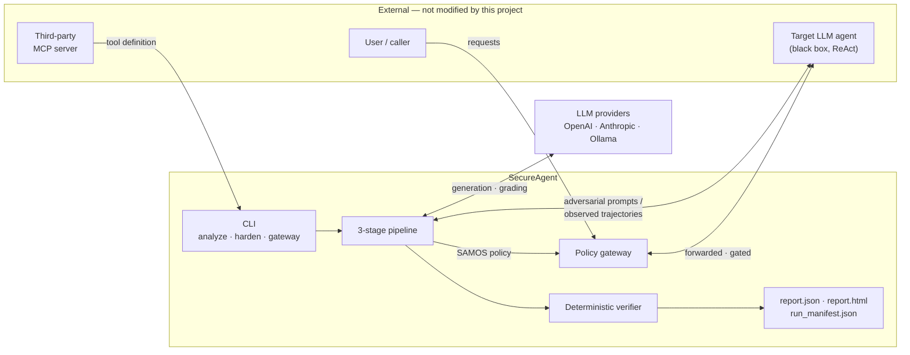

# REQUIREMENT ANALYSIS

## 2.1 Literature Survey

### 2.1.1 Theory Associated With Problem Area

Four bodies of theory bear on this project: the nature of prompt injection, the
distinction between direct and indirect delivery, classical information-flow control,
and automated red-teaming.

**Prompt injection and the absent privilege boundary.** The founding observation of the
field is architectural rather than empirical: a language model has no structural
separation between the instructions it was given and the data it is asked to process.
Everything arrives as tokens in one context window. Liu et al. made this concrete at
application scale with HouYi, a black-box attack decomposing injection into a framework
component, a context-partitioning separator and a payload, finding 31 of 36 commercial
LLM-integrated applications susceptible [1]. Liu et al. subsequently supplied the formal
treatment the field lacked — a unified framework in which naive injection, escape
characters, context ignoring and fake completion are instances of a single construction,
benchmarked across 5 attacks, 10 defenses, 10 models and 7 tasks [2]. Their
methodological contribution matters more than any individual number: before it, the
literature was a collection of mutually incomparable case studies.

Two properties of this attack class recur throughout. First, the attacks are cheap and
automatable — Liu et al. show gradient-based optimisation yields universal injection
strings from roughly 0.3% of a test set, and warn that defenses evaluated only against
hand-written attacks will be systematically overestimated [3]. Second, injection success
is not binary at the prompt level; it depends on whether the model's downstream *action*
is consequential. That is precisely why the tool-using setting is where injection becomes
a security problem rather than an output-quality problem.

Wallace et al. diagnose the root cause at design level: models treat system, user and
tool-returned text as equally privileged, and the remedy proposed is to train an explicit
**instruction hierarchy** [4]. This reframes injection as a missing privilege model — the
same framing this project adopts, but relocated from the model's weights to the
tool-dispatch boundary.

**Direct versus indirect delivery.** Greshake et al. introduced the threat model this
project principally targets: the attacker never talks to the model at all [5]. Instead,
instructions are planted in content the model will *retrieve* — a web page, a document,
an email. The essential change is the location of the trust boundary. The user's turn is
entirely benign, so any defense scrutinising the user's request is looking in the wrong
place. Because the two channels fail for different reasons and are defended
differently, this project records a `delivery_channel` on every attack record and never
pools direct and indirect results.

**Classical information-flow control.** The theoretical apparatus for constraining data
movement predates LLMs by decades. Myers and Liskov introduced the decentralised label
model, in which data carries labels naming owners and readers, and declassification is an
explicit authorised act [14]. Sabelfeld and Myers survey language-based enforcement of
noninterference and catalogue why pure noninterference is too strong for real programs
and what controlled relaxations cost [15]. Both supply this project's central caution:
noninterference is trivially satisfied by refusing everything, so "block every flow" is a
safe and useless policy. The confidentiality annotations, taint levels and monotone taint
propagation in the SAMOS policy model are direct descendants of this line.

**Automated red-teaming.** Perez et al. established the template of using one language
model to generate test cases against another, uncovering tens of thousands of offensive
replies plus privacy leaks in a deployed chatbot, with a ladder of generation strategies
trading difficulty against diversity [24]. Chao et al. sharpened this into PAIR, where an
attacker LLM iteratively refines a jailbreak against a black-box target using feedback,
typically succeeding in fewer than twenty queries [25]. The generate–observe–refine loop,
and specifically escalation on refusal, is what this project's Stage 1.3 refiner
implements on a per-tool basis.

### 2.1.2 Existing Systems and Solutions

Existing work divides into four families, each with a characteristic strength and a
characteristic limitation.

**Benchmarks and evaluation harnesses.** AgentDojo is the most influential: 97 realistic
tasks across email, banking and travel domains plus 629 security test cases, built as an
extensible *environment* rather than a fixed dataset so new attacks and adaptive defenses
can be added [8]. Its crucial methodological choice — scoring utility and security
together, on the principle that a defense which breaks the agent is not a good defense —
is the norm this project's ABR/BPR/F1 reporting follows. AgentHarm measures a different
quantity: whether an agent will *comply* with an explicitly malicious user across 110
tasks and 11 harm categories, finding leading models surprisingly compliant without any
jailbreak [9]. Its threat model is a malicious user rather than a compromised data
channel, which is why this project demoted the AgentHarm harm taxonomy to a secondary
comparability field — content-harm categories do not describe what a *tool* can be abused
for, and instructing a file reader to produce hate speech fails for reasons unrelated to
the tool's security. Agent Security Bench is the broadest sweep, covering 10 scenarios,
400+ tools, 27 attack/defense methods and 13 backbones, reporting attack success up to
84.3% with existing defenses providing limited protection [10]. InjecAgent operationalises
indirect injection specifically for tool-using agents with 1,054 test cases over 17 user
tools and 62 attacker tools, finding a ReAct-prompted GPT-4 acting on injected
instructions 24% of the time [6]. ToolEmu approaches risk discovery from the sandbox side,
using a language model to emulate tool execution so that 36 high-stakes tools can be
exercised across 144 cases without real-world side effects, with 68.8% of identified
failures judged valid by human review [7].

**Prompt-level defenses.** Hines et al. introduced spotlighting and datamarking:
transform untrusted input so its provenance is continuously signalled to the model,
reducing attack success from over 50% to under 2% on GPT-family models with minimal
task-efficacy loss [11]. Those numbers set the bar honestly, and this project implements
spotlighting, instruction defense, sandwich and prompt-level sink restriction as baseline
conditions precisely so that the comparison is not "policy versus nothing".

**Model-level defenses.** StruQ pairs a structured-query interface with a model
fine-tuned to ignore instructions appearing in the data channel [12]; SecAlign extends
this by framing the defense as preference optimisation over secure/insecure response
pairs, reporting substantially lower success rates including against optimisation-based
attacks [13]. Both require weight access.

**System-level defenses.** CaMeL is the strongest modern instantiation and the closest
prior art to this work. It extracts control and data flow from the *trusted* user query
into an explicit program, runs untrusted data through a quarantined model that cannot
influence control flow, and attaches capabilities to values so that exfiltration over
unauthorised data flows is prevented at the point the tool is called. On AgentDojo it
solves 77% of tasks with provable security against the modeled attacker class, versus 84%
undefended [16]. Beurer-Kellner et al. generalise this into six design patterns with
provable injection resistance, applied to ten case studies with explicit utility/security
analysis; their central claim — that security comes from constraining what the agent
*may do*, not from better prompting — is the argument this project's enforcement gates
instantiate [17]. Wu et al. give an information-flow-control treatment with formal
guarantees, disaggregating the system into a context-aware pipeline with dynamically
generated structured plans plus a security monitor filtering untrusted input [18], while
IsolateGPT attacks the problem through execution isolation between third-party LLM apps,
reporting protection against several threat classes at under 30% overhead for most
queries [19].

**MCP-specific work.** OWASP codifies the description-as-attack-surface problem as
`MCP03:2025 Tool Poisoning`, noting that one poisoned schema replicated across tenants
multiplies blast radius [20]. MCPTox provides the strongest empirical evidence: 1,312
malicious test cases built from 45 real-world MCP servers and 353 authentic tools,
evaluated over 20 agents, with attack success as high as 72.8% and refusal rates below 3%
even for the most conservative model tested [21]. MCPXKIT complements it with a unified
toolkit implementing 31 attack methods across four classes, identifying blind reliance on
tool descriptions as a recurring root cause [22], and MCPGuard builds toward automated MCP
server vulnerability detection spanning scanning, auditing and runtime monitoring [23].

**Policy synthesis.** Progent is the nearest neighbour on the synthesis axis: it generates
symbolic privilege-control policies for agents from the user task, enforces them
deterministically at tool-call time, and uses an SMT solver to distinguish policy
narrowing from expansion, reporting reduced attack success at maintained utility on
AgentDojo and ASB [26].

Table 2.1 condenses the comparison. It is referred to throughout §2.1.4.

TABLE 2.1: Comparison of prior work by approach, domain, headline result and limitation.

| Ref | Work | Approach | Domain | Result | Limitation |
|---|---|---|---|---|---|
| [1] | HouYi | Black-box injection: separator + payload | LLM-integrated apps | 31/36 commercial apps vulnerable | Attack only; manual construction |
| [2] | Liu et al. | Formal framework + common benchmark | Prompt injection | 5 attacks × 10 defenses × 10 LLMs × 7 tasks | Text completion, not tool-using agents |
| [3] | Liu et al. | Gradient-based universal injection | White-box LLMs | Universal strings from ~0.3% of data | Requires gradient access |
| [4] | Instruction Hierarchy | Privilege-aware training | Model alignment | Large robustness gains, minor capability cost | Model-resident; fails once model complies |
| [5] | Greshake et al. | Indirect injection taxonomy + PoCs | LLM-integrated apps | Working attacks on Bing Chat, code completion | Demos; no quantitative benchmark |
| [6] | InjecAgent | Templated indirect-injection benchmark | Tool-integrated agents | ReAct GPT-4 attacked 24% of the time | Fixed templates; no defense produced |
| [7] | ToolEmu | LM-emulated tool sandbox | Agent risk discovery | 68.8% of found failures human-validated | Emulation fidelity gap |
| [8] | AgentDojo | Extensible attack/defense environment | Tool-using agents | 97 tasks, 629 security cases; dual scoring | Fixed suite; evaluates, does not harden |
| [9] | AgentHarm | Curated harmful-task benchmark | Agent misuse | 110 tasks; models compliant without jailbreak | Malicious-*user* model; content-harm axis |
| [10] | ASB | Broad attack/defense benchmark | LLM agents | ASR up to 84.3%; defenses weak | Breadth over depth; no artifact |
| [11] | Spotlighting | Provenance marking of untrusted input | Indirect injection | ASR >50% → <2% | Prompt-level; relies on compliance |
| [12] | StruQ | Structured query + fine-tuning | Prompt injection | Strong reduction, utility preserved | Needs fine-tuning |
| [13] | SecAlign | Preference optimisation | Prompt injection | Large ASR reduction | Weight access; probabilistic |
| [14] | DLM | Decentralised labels + declassification | IFC (classical) | Fine-grained sharing under distrust | Pre-LLM; needs a labelled program |
| [15] | Sabelfeld & Myers | Survey of language-based IFC | IFC (classical) | Canonical noninterference framing | Strict noninterference impractical |
| [16] | **CaMeL** | Control/data-flow extraction + capabilities | Tool-using agents | 77% AgentDojo solved, provable security (84% undefended) | **Requires agent rewrite** |
| [17] | Design patterns | Six patterns with provable resistance | Agent architecture | 10 case studies, utility/security analysis | Manual, per-application |
| [18] | Wu et al. | IFC pipeline + security monitor | LLM systems | Formal guarantees, retained utility | New runtime required |
| [19] | IsolateGPT | Execution isolation between apps | LLM app ecosystems | Threats blocked at <30% overhead | Architectural change; isolation not flow policy |
| [20] | OWASP MCP Top 10 | Threat catalogue (`MCP03`) | MCP | Standard framing + controls | Guidance, not measurement |
| [21] | MCPTox | Poisoning benchmark, real servers | MCP | ASR 72.8%; refusal <3% | Attack-side only |
| [22] | MCPXKIT | Unified toolkit, 31 attacks | MCP | Root cause: blind trust in descriptions | No runtime enforcement |
| [23] | MCPGuard | MCP server vulnerability detection | MCP | Scanning + auditing + monitoring | Server-level, not per-description |
| [24] | Perez et al. | LM-generated red-team cases | LM safety | Tens of thousands of harmful replies | Single-turn; no tools, no policy |
| [25] | PAIR | Attacker LLM refines jailbreak | Black-box LLMs | Jailbreaks in ≲20 queries | Content jailbreaks, not tool abuse |
| [26] | **Progent** | Symbolic privilege policies at tool call | LLM agents | Lower ASR at maintained utility | **Policy from the *trusted user task*** |

### 2.1.3 Research Findings for Existing Literature

Table 2.2 presents the literature in the format prescribed by the report template, with
papers apportioned per team member.

Papers are apportioned according to the team's proposal-stage role allocation: attack-side
literature to the Red Agent members, defense and policy-synthesis literature to the
Defender Agent members, and the information-flow and MCP-specific literature to the
integration and enforcement lead. **[VERIFY: Aarav — confirm this allocation against the
contribution basis being prepared; it is provisional.]**

TABLE 2.2: Literature survey, apportioned by team member.

| S. No. | Roll Number | Name | Paper Title | Tools / Technology | Findings | Citation |
|---|---|---|---|---|---|---|
| 1 | 102303904 | Akshat Srivastava | Prompt injection attack against LLM-integrated applications | HouYi; black-box probing | 31 of 36 commercial apps vulnerable; injection = framework + separator + payload | [1] |
| 2 | 102303904 | Akshat Srivastava | Formalizing and benchmarking prompt injection attacks and defenses | Unified formal framework | Common benchmark: 5 attacks × 10 defenses × 10 LLMs × 7 tasks | [2] |
| 3 | 102303904 | Akshat Srivastava | Automatic and universal prompt injection attacks against LLMs | Gradient-based optimisation | Universal injection strings from ~0.3% of a test set; hand-written-attack evaluations overestimate defenses | [3] |
| 4 | 102306026 | Hiten Yadav | The instruction hierarchy: training LLMs to prioritize privileged instructions | Hierarchical instruction training | Root cause is equal privilege for system/user/tool text; large robustness gains | [4] |
| 5 | 102303904 | Akshat Srivastava | Not what you've signed up for: compromising real-world LLM-integrated applications with indirect prompt injection | Threat taxonomy + PoCs | Attacker need never contact the model; working attacks on Bing Chat | [5] |
| 6 | 102303904 | Akshat Srivastava | InjecAgent: benchmarking indirect prompt injections in tool-integrated LLM agents | 1,054 cases, 17 user + 62 attacker tools | ReAct GPT-4 acts on injected instructions 24% of the time | [6] |
| 7 | 102317215 | Sanil Grover | Identifying the risks of LM agents with an LM-emulated sandbox | ToolEmu; LM tool emulation | 36 tools, 144 cases; 68.8% of failures human-validated | [7] |
| 8 | 102317215 | Sanil Grover | AgentDojo: a dynamic environment to evaluate prompt injection attacks and defenses | Extensible environment | 97 tasks, 629 security cases; utility and security scored together | [8] |
| 9 | 102317215 | Sanil Grover | AgentHarm: a benchmark for measuring harmfulness of LLM agents | 110 tasks, 11 harm categories | Models comply without jailbreak; malicious-user threat model | [9] |
| 10 | 102317215 | Sanil Grover | Agent Security Bench (ASB) | 10 scenarios, 400+ tools, 27 methods | ASR up to 84.3%; existing defenses provide limited protection | [10] |
| 11 | 102306026 | Hiten Yadav | Defending against indirect prompt injection attacks with spotlighting | Delimiting, datamarking, encoding | ASR >50% → <2% with minimal utility loss | [11] |
| 12 | 102306026 | Hiten Yadav | StruQ: defending against prompt injection with structured queries | Structured query + fine-tuning | Strong reduction with preserved utility; requires weight access | [12] |
| 13 | 102306026 | Hiten Yadav | SecAlign: defending against prompt injection with preference optimization | DPO over secure/insecure pairs | Large ASR reduction incl. optimisation attacks | [13] |
| 14 | 102303179 | Aarav Dudeja | A decentralized model for information flow control | DLM labels; declassification | Owners/readers labels; declassification as an explicit authorised act | [14] |
| 15 | 102306046 | Simran Arora | Language-based information-flow security | Survey of noninterference | Strict noninterference too strong; controlled relaxations required | [15] |
| 16 | 102306046 | Simran Arora | Defeating prompt injections by design (CaMeL) | Custom interpreter; P-LLM/Q-LLM split | 77% AgentDojo solved with provable security vs 84% undefended | [16] |
| 17 | 102306026 | Hiten Yadav | Design patterns for securing LLM agents against prompt injections | Six architectural patterns | Security from constraining action, not better prompting | [17] |
| 18 | 102306046 | Simran Arora | System-level defense against indirect prompt injection: an IFC perspective | IFC pipeline + security monitor | Formal guarantees with retained utility | [18] |
| 19 | 102306046 | Simran Arora | IsolateGPT: an execution isolation architecture for LLM-based agentic systems | Execution isolation | Threat classes blocked at <30% overhead for most queries | [19] |
| 20 | 102303179 | Aarav Dudeja | MCP03:2025 – Tool poisoning (OWASP MCP Top 10) | Threat catalogue | Poisoned schema replicated across tenants multiplies blast radius | [20] |
| 21 | 102303179 | Aarav Dudeja | MCPTox: a benchmark for tool poisoning attack on real-world MCP servers | 1,312 cases, 45 servers, 353 tools | ASR up to 72.8% (o1-mini); refusal <3% | [21] |
| 22 | 102303179 | Aarav Dudeja | MCPXKIT: the unified toolkit for analyzing MCP security | 31 attack methods, 4 classes | Blind reliance on tool descriptions is the recurring root cause | [22] |
| 23 | 102303179 | Aarav Dudeja | MCPGuard: automatically detecting vulnerabilities in MCP servers | Scanning, auditing, monitoring | Server-side detection pipeline for MCP deployments | [23] |
| 24 | 102317215 | Sanil Grover | Red teaming language models with language models | LM-generated test cases | Tens of thousands of harmful replies; strategy ladder | [24] |
| 25 | 102317215 | Sanil Grover | Jailbreaking black box large language models in twenty queries (PAIR) | Iterative attacker LLM | Jailbreaks typically in fewer than 20 queries | [25] |
| 26 | 102306046 | Simran Arora | Progent: securing AI agents with privilege control | Symbolic policy + SMT solver | Reduced ASR at maintained utility; policy from trusted user task | [26] |

### 2.1.4 Problem Identified

Reading Table 2.1 across rows rather than down columns produces a consistent picture and
one specific vacancy.

**What the literature establishes.** Attack success against undefended tool-using agents
is high — 24% for indirect injection on a ReAct GPT-4 [6], up to 84.3% across the ASB
sweep [10], up to 72.8% on real MCP servers [21]. The root cause is agreed: models treat
tool-returned text as privileged [4], and MCP agents rely blindly on tool descriptions
[22]. And the defenses divide cleanly into those that are cheap but probabilistic
[11]–[13] and those that are strong but architecturally intrusive [16]–[19].

**Research Gap and Positioning of Present Work.**

*(a) Which surveyed limitations this work addresses.* Three, specifically. First, the
benchmarks [8]–[10] evaluate without hardening — they end at a score, produce no
deployable artifact, and cannot generate attacks for a tool definition they have never
seen. This work ends at an enforced gateway and generates its attacks per tool. Second,
the prompt- and model-level defenses [4], [11]–[13] are conditional on model behaviour
and provide nothing once the model complies; a deterministic gate at the dispatch
boundary is not. Third, the system-level defenses [16]–[19] each require adopting a new
agent runtime, and none synthesises its policy from an adversarially discovered attack
surface — their policies are authored, not learned.

*(b) What this work does differently, at a technical level.* The pipeline treats the tool
description as an **untrusted artifact to be probed**, not as a specification to be
trusted. Stage 1 generates attacks across a six-objective × eight-technique matrix and
refines them against a live agent, escalating to a strictly stronger technique when the
agent refuses, so a refusal advances the search rather than terminating it
(`stage1/refiner.py`). Stage 3 compiles what actually worked into a SAMOS policy, and the
verifier replays trajectories through that policy **with no model call in the loop**
(`verifier/replay.py`) — which is what makes coverage a measurement rather than a
prediction. Four gates apply in order: capability denial; IFC-001, blocking a write to a
low-confidentiality sink once the session has read high-confidentiality data; IFC-002,
its dual, blocking a consequential action once the session has ingested attacker-controlled
content; and argument-aware enforcement rules, which match a rule to a call by tool name
and then evaluate the rule's quoted argument literals against the call's actual parameters.
That last mechanism is what lifts the security/utility F1 above zero for tools whose
malicious and benign calls differ only in *arguments* — `execute_command`,
`database_query`, `http_request`, `send_email` — rather than in tool identity. The same
replay function is then run over a benign-task suite, yielding ABR, BPR and their
harmonic mean, so a deny-all policy scores zero by construction. Two generator-side
guards (`_guard_core_capabilities`, `_guard_core_tool_blocks`) exist because that
degenerate policy was produced repeatedly in practice, not because it was anticipated in
theory.

*(c) What this work deliberately does not attempt, and why that scoping is defensible.*
It does not attempt to beat CaMeL [16] on security, and does not claim to. CaMeL's
guarantee holds by construction for the flows it models; the policy here is LLM-generated
and may be over-broad or incomplete, and every number reported is measured rather than
proven. The delta is the operating point, stated narrowly: no agent rewrite, automatic
per-tool synthesis, and poisoned descriptions inside the threat model rather than outside
it. Where an agent *can* be rebuilt, CaMeL is the stronger choice, and the report says
so. Similarly, cross-server tool shadowing, rug pulls and MCP authorization /
confused-deputy problems are excluded because they are identity- and protocol-layer
concerns that a per-tool information-flow policy structurally cannot address; including
them would be scope inflation, not coverage. Finally, tool *implementations* are never
inspected or modified — the honest framing is description-derived attack-surface analysis
plus runtime policy synthesis, and any stronger claim would misrepresent what the code
does. Against the MCP literature [20]–[23], the poisoning work here is a **detection**
result on a small matched-control set, not a competing benchmark; MCPTox [21], with 45+
real servers, remains the stronger attack-side evidence.

The vacancy this work occupies is therefore narrow but real: **per-tool,
description-derived attack-surface analysis producing an enforceable information-flow
policy for an agent nobody rewrote.**

### 2.1.5 Survey of Tools and Technologies Used

Table 2.3 summarises the technologies surveyed and the rationale for adopting or
rejecting each.

TABLE 2.3: Tools and technologies surveyed, with the rationale for adoption or rejection.

| S. No. | Technology | Version | Role | Rationale / alternatives considered |
|---|---|---|---|---|
| 1 | Python | ≥ 3.10 | Implementation language | Ecosystem for LLM tooling; sole language in the repository |
| 2 | LiteLLM | 1.81.16 | Provider routing, retries, failover | Single abstraction over OpenAI/Anthropic/Azure; avoids per-provider SDK code. Retains `num_retries=3` failover |
| 3 | Pydantic v2 | 2.12.5 | Inter-stage data contracts | Every stage boundary is a typed model — no untyped dictionaries cross stages; validation is enforcement, not documentation |
| 4 | pydantic-settings | 2.13.1 | Layered configuration | Gives the required YAML → environment → CLI precedence in one mechanism |
| 5 | Typer | 0.24.1 | CLI framework | Type-hint-driven; three commands (`analyze`, `harden`, `gateway`) |
| 6 | FastAPI | 0.135.1 | Gateway and evaluation-agent servers | ASGI, automatic validation; both servers expose small JSON APIs |
| 7 | uvicorn | 0.41.0 | ASGI server | Standard pairing with FastAPI |
| 8 | httpx | 0.28.1 | Agent HTTP client | Timeout control (120 s) and connection reuse for the attack loop |
| 9 | Rich | 14.3.3 | Live terminal monitoring | Thread-safe live table driven by refiner progress events |
| 10 | Jinja2 | 3.1.6 | HTML report templating | 1,028-line dashboard template; no frontend build step required |
| 11 | Chart.js | via template | Report visualisations | Client-side charts without a bundler |
| 12 | Ollama | — | Self-hosted model serving | Removes per-token cost and rate limits for iteration; reached by direct HTTP rather than through LiteLLM to control `think` and JSON-format flags |
| 13 | pytest | 9.0.2 | Test framework | 205 tests across 17 modules |
| 14 | ruff | 0.15.2 | Linting | Line length 100, target `py310` |
| 15 | mypy | 1.19.1 | Static typing | `strict = true` with the Pydantic plugin |
| 16 | PyYAML | 6.0.3 | Tool and benign-suite parsing | Tool corpus and benign suites are YAML |
| 17 | jsonschema | 4.26.0 | `inputSchema` validation | Conformance checking of MCP tool definitions |
| 18 | uv | — | Dependency resolution | `uv.lock` is the only fully pinned artifact; `pyproject.toml` declares lower bounds only |
| 19 | Cloudflare Quick Tunnel | — | Exposing a GPU-hosted Ollama daemon | Free and ephemeral; rejected named tunnels as unnecessary at this scale |
| 20 | draw.io | — | Diagram authoring | One use-case diagram source exists; not yet rendered |

Two rejections are worth recording. A **database** was considered and rejected: all
pipeline state is either in-process or a JSON/YAML artifact on disk, and introducing
persistence would add operational surface without serving a requirement. **Docker** was
considered and deferred: Stage 3 emits container enforcement directives, so containerised
deployment is a natural next step, but no Dockerfile exists and the generated directives
have never been applied to a real container — stated here rather than implied by the
presence of the directive generator.

## 2.2 Software Requirement Specification

### 2.2.1 Introduction

#### 2.2.1.1 Purpose

This specification defines the functional and non-functional requirements of
**SecureAgent** version 0.1.0 (implemented as the `agent-hardener` package), a system that analyses a single MCP tool definition for
exploitability and synthesises, verifies and enforces an information-flow security policy
for it. The specification covers the analysis pipeline, the deterministic verifier, the
evaluation harness and the runtime policy gateway. It does not cover the target agent
being protected, which is treated throughout as an external black box.

#### 2.2.1.2 Intended Audience and Reading Suggestions

| Reader | Suggested path |
|---|---|
| Project panel / evaluators | §2.2.2 for scope and features, then Chapter 4 for design and Chapter 5 §5.1 for status against objectives |
| Security reviewers | §2.2.4.3 security requirements, then §4.1–§4.2 for the gate architecture and threat model |
| Developers extending the pipeline | §2.2.3 external interfaces, then Chapter 3 §3.3 for the module breakdown |
| Operators deploying the gateway | §2.2.3.3 software interfaces and §2.2.4.1 performance requirements |
| Cost / planning stakeholders | §2.3 and its assumptions register |

#### 2.2.1.3 Project Scope

The system accepts an MCP tool definition in YAML or JSON, an endpoint for a live target
agent, and a configuration specifying models and thresholds. It produces a machine-readable
`report.json`, an HTML dashboard, a reproducibility manifest, and a SAMOS policy document
that can be loaded by the gateway to enforce controls at runtime in front of the unmodified
agent. Boundaries are as stated in §1.4: description-level analysis only, no tool
implementation is read or modified, and no formal correctness proof is offered.

### 2.2.2 Overall Description

#### 2.2.2.1 Product Perspective

SecureAgent is a self-contained analysis and enforcement product that sits alongside an
existing agent deployment rather than inside it. Figure 2.1 shows its context.

**FIGURE 2.1: System context. The pipeline consumes a third-party tool definition and
probes an unmodified target agent; the gateway later sits between callers and that same
agent to enforce the synthesised policy.**

As Figure 2.1 shows, the only components this project controls are inside the `SYS`
boundary. The target agent is never modified — this is the constraint from which the
gateway design follows. The system depends on external LLM providers for generation and
grading, and on a reachable agent endpoint for the attack loop.

#### 2.2.2.2 Product Features

| ID | Feature | Description |
|---|---|---|
| F1 | Tool profiling | Extracts data endpoints, capability profile, description ambiguities and injected-instruction evidence from a tool definition |
| F2 | Tool-poisoning detection | Flags `poisoning_suspected` from injected-instruction spans or an explicit boolean |
| F3 | Attack generation | One adversarial prompt per objective × technique, across 6 misuse objectives and 8 ranked techniques |
| F4 | Indirect-injection attacks | Payloads planted in tool *results* with a benign user turn; delivery channel recorded per attack |
| F5 | Iterative refinement | Red-Agent-Reflect loop with escalation to a stronger technique on refusal |
| F6 | LLM-as-judge grading | 0.0–1.0 rubric scoring with a deterministic heuristic floor |
| F7 | Exploit classification | Five-type taxonomy (A–E) per successful attack |
| F8 | Documentation-edit recommendation | MODIFY / ADD / DELETE edits targeting the exploited element |
| F9 | SAMOS policy synthesis | Confidentiality annotations, capability allowed-sets, taint rules, enforcement rules, deployment spec |
| F10 | Anti-deny-all guards | Two generator-side guards preventing degenerate capability denial |
| F11 | Deterministic verification | Four-gate replay with no model call; per-record verdicts shipped in the report |
| F12 | Security/utility evaluation | ABR, BPR, over-block rate, mitigation rate, F1, `degenerate_deny_all` |
| F13 | Runtime enforcement gateway | FastAPI service applying the gates to live traffic, with audit ring and JSONL sink |
| F14 | Iterative hardening | Multi-round loop feeding edits back into the tool definition |
| F15 | Defense baselines | Five prompt-level defense conditions for comparison |
| F16 | Reporting | JSON + HTML with bootstrap confidence intervals |
| F17 | Reproducibility manifest | Models, versions, settings, pipeline health per run |
| F18 | Seed sweeps | Repeat runs per attack with per-seed scores and mean aggregation |

### 2.2.3 External Interface Requirements

#### 2.2.3.1 User Interfaces

The system has two user-facing surfaces and no graphical application interface.

1. **Command-line interface** (`agent-hardener`), built with Typer, exposing `analyze`,
   `harden` and `gateway`. During a run a Rich live table shows per-attack progress —
   attempt number, current strategy, score and status — updated from refiner progress
   events. The renderer selects glyphs safe for cp1252 terminals.
   `[SCREENSHOT: terminal mid-run during 'agent-hardener analyze --tool-file mcp_tools/read_file.yaml', with the Rich live table showing at least three attacks in different states — one succeeded, one refused, one in progress]`
2. **HTML report dashboard**, a single self-contained page rendered from a 1,028-line
   Jinja template with Chart.js visualisations, covering headline metrics, per-category
   attack outcomes, policy coverage and the security/utility panel with its
   degenerate-policy banner.
   `[SCREENSHOT: sample_report/report.html opened in a browser, scrolled to the Stage 3 security/utility panel showing ABR, BPR and F1]`

#### 2.2.3.2 Hardware Interfaces

The system has no direct hardware interfaces. It is hardware-sensitive in one respect: when
models are served locally through Ollama, a GPU with sufficient VRAM is required. A 27B
model at 4-bit quantisation requires approximately 18–20 GB, so a single 48 GB card holds
both a generation and a grader model resident. No GPU is required when hosted APIs are
used.

#### 2.2.3.3 Software Interfaces

| Interface | Protocol | Direction | Contract |
|---|---|---|---|
| Target agent | HTTP POST `/run` | Outbound | Request `{prompt, system_prompt?, injections?}`; response `{tool_calls[], assistant_messages[], refusal_detected, refusal_message, injections_fired[], ingested_untrusted_content, steps_used}`. Timeout 120 s; optional bearer token |
| MCP tool discovery | JSON-RPC 2.0 over HTTP POST `/tools/list` | Outbound | Standard MCP `tools/list` result |
| LLM providers | HTTPS via LiteLLM Router | Outbound | OpenAI / Anthropic / Azure deployments named `primary` and `grader` |
| Ollama | HTTP POST `/api/chat`, `/api/generate` | Outbound | Direct calls bypassing LiteLLM to control `think: false` and JSON-format enforcement; 300 s timeout |
| Gateway `POST /run` | HTTP | Inbound | `{prompt}`; returns trajectory plus `enforcement_log` and `policy_tool`. 400 on invalid body, 502 on inner-agent failure |
| Gateway `GET /health`, `/policy`, `/audit` | HTTP | Inbound | Status, full policy document, and the audit ring (`limit` query parameter) |
| Gateway `POST /tools/list` | JSON-RPC 2.0 | Inbound | Returns the policy's tool annotations |
| Configuration | YAML + environment + CLI | Inbound | `config.yaml`, then uppercase environment variables, then CLI flags |
| Reports | Filesystem | Outbound | `report.json`, `report.html`, `run_manifest.json`, `hardening_history.json` |

Only the `http` agent transport is implemented; `stdio` and `sse` are configurable but
unimplemented and must not be relied upon.

### 2.2.4 Other Non-functional Requirements

#### 2.2.4.1 Performance Requirements

| ID | Requirement | Current evidence |
|---|---|---|
| P1 | A full `analyze` run on one tool completes within one hour on commodity hardware | A recorded run took 269.93 s at `max_iterations = 2`; §2.3 assumes ≈25 min at `max_iterations = 6` — an extrapolation, not a measurement |
| P2 | Attack cycles execute concurrently, with concurrency configurable | `attack_parallelism`, default 2; must be set to 1 for reproducible runs |
| P3 | Verifier replay is deterministic and involves no network or model call | Structural property of `verifier/replay.py` |
| P4 | Gateway per-request overhead is bounded by replay of an already-complete trajectory | Enforcement is post-hoc; overhead not yet measured |
| P5 | Provider failures are retried without aborting the run | LiteLLM `Router(num_retries=3, retry_after=5)`; Ollama direct calls have **no** retry |
| P6 | Malformed model output does not abort attack generation | Four-tier JSON recovery ending in a deterministic template fallback, with `is_fallback` recorded |

P1 and P4 are **not yet measured**; `scripts/benchmark_models.py` exists to measure
per-model latency but has never been executed.

#### 2.2.4.2 Safety Requirements

| ID | Requirement | Mechanism |
|---|---|---|
| S1 | Adversarial prompts must never cause real-world side effects during evaluation | Tool execution in the evaluation agent is simulated with canned results |
| S2 | The superseded keyword stub, which really invokes `subprocess` and reads real files, must not be used as an evaluation target | Deprecated in favour of `scripts/llm_agent_server.py`; **enforced by documentation only, not by code** |
| S3 | A generated policy must never disable the tool's core capability outright | `_guard_core_capabilities` restores capabilities the profile marks as used |
| S4 | A generated policy must never block every benign use | `_guard_core_tool_blocks` downgrades core-tool BLOCK rules; `degenerate_deny_all` flags the failure if it survives |
| S5 | Enforcement must fail secure for unknown tools | `fail_secure_unknown_tools` in the gateway enforcement spec |
| S6 | Blocked calls must not leak downstream effects | The gateway rewrites the blocked call as failed and drops all subsequent calls |

#### 2.2.4.3 Security Requirements

| ID | Requirement | Status |
|---|---|---|
| SEC1 | The tool description must be treated as untrusted input | Implemented — profiler emits `injected_instructions` and `poisoning_suspected` |
| SEC2 | High-confidentiality data must not flow to a low-confidentiality sink within a session | Implemented — IFC-001 in `verifier/replay.py` |
| SEC3 | An action must not be taken on attacker-controlled content ingested earlier in the session | Implemented in the verifier (IFC-002); **not implemented in the live gateway** — a known asymmetry |
| SEC4 | Enforcement rules must discriminate by argument, not only by tool identity | Implemented — argument-literal masking with OR-of-ANDs evaluation and a name-only fail-safe |
| SEC5 | Taint must be monotone within a session | Implemented — governed by `taint_is_monotonic` |
| SEC6 | Every enforcement decision must be auditable | Implemented — per-record verdicts in `report.json`; audit ring plus optional JSONL sink in the gateway |
| SEC7 | Secrets must not be committed | Implemented — `config.yaml` is gitignored; `config.example.yaml` is the template |
| SEC8 | The grader must not belong to the same model family as the generator | Partially implemented — a `UserWarning` is raised and `same_family_grader` is recorded, but the run is not prevented |
| SEC9 | Gateway endpoints must be authenticated | **Not implemented.** No endpoint on any of the three servers has authentication; the gateway only forwards a bearer token to the inner agent. Acceptable for a local research deployment, a blocker for production |

SEC9 is recorded as an open defect rather than a limitation, and is carried into §5.4.

## 2.3 Cost Analysis

All figures are in Indian Rupees at **1 USD = ₹95.61**, the spot rate for 17 August 2026;
provider pricing pages were fetched on 18 August 2026. Providers bill in USD, so INR
figures are indicative and move with the rate; a ±0.5% band reflects that week's trading
range, and card forex markup of 2–3.5% is **not** included.

### 2.3.1 Assumptions

Table 2.4 states every assumption underlying the estimates. These are assumptions, not
measurements; where the repository constrains a value, the constraining file is named.

TABLE 2.4: Cost model assumptions.

| ID | Assumption | Basis |
|---|---|---|
| A1 | One run = `analyze` on one tool, 6 misuse objectives × breadth 1 = 6 adversarial prompts | `config.example.yaml` |
| A2 | `max_iterations = 6`, attacks run to budget (worst case) | `config.example.yaml` |
| A3 | ≈84 pipeline LLM calls per run | Counted call sites across `stage1/`, `stage2/`, `stage3/` |
| A4 | ≈108 target-agent LLM calls per run (6 attacks × 6 iterations × 3 ReAct steps) | `scripts/llm_agent_server.py`; the agent under test is itself an LLM |
| A5 | Pipeline call shape: 2,000 input / 600 output tokens; grader 2,000 / 400 | Anchored to configured token caps in `shared/model_config.py` |
| A6 | Agent call shape: 1,500 input / 250 output tokens | System prompt + 10 tool schemas + growing ReAct history |
| A7 | 25 minutes wall clock per run | Extrapolated from a recorded 269.93 s run at `max_iterations = 2` |
| A8 | GPU node draws 0.7 kW under sustained inference | Assumption; no power telemetry exists |
| A9 | Electricity at ₹8.00/kWh | Mid-point for an institutional connection |
| A10 | +20% token overhead for retries and failed JSON parses | `num_retries=3` plus explicit retry paths in `attacker.py`, `profiler.py` |
| A11 | Full protocol = 50 runs (10 tools × 5 repeats) | Corpus size × the n ≥ 5 requirement |
| A12 | Gateway hosted for one month | Assumption |
| A13 | Batch API and prompt caching unused (code path is synchronous) | `shared/llm_provider.py` |

Derived per-run volume: **192 calls, 0.33 M input tokens, 0.0702 M output tokens**; across
50 runs, **16.50 M input and 3.51 M output tokens**.

### 2.3.2 Unit Costs

Table 2.5 gives the unit prices from which the scenario totals in Table 2.6 are derived.

TABLE 2.5: Unit prices by provider (INR, converted at ₹95.61/USD).

| Provider / resource | Unit | Input | Output |
|---|---|---|---|
| OpenAI GPT-4o | per 1M tokens | ₹239.03 | ₹956.10 |
| OpenAI GPT-4o mini | per 1M tokens | ₹14.34 | ₹57.37 |
| Anthropic Claude Haiku 4.5 | per 1M tokens | ₹95.61 | ₹478.05 |
| Anthropic Claude Opus 5 | per 1M tokens | ₹478.05 | ₹2,390.25 |
| RTX A6000 48GB (community) | per hour | ₹31.55 | — |
| A100 80GB PCIe (community) | per hour | ₹113.78 | — |
| Cloudflare Quick Tunnel | — | ₹0 | — |
| Render Web Service, Starter | per month | ₹669.27 `[VERIFY: Render, Starter plan]` | — |
| Ollama, LiteLLM, FastAPI, pytest, ruff, mypy | — | ₹0 (open source) | — |
| CI | — | ₹0 (no CI configured) | — |

`[VERIFY: Microsoft Azure — Azure OpenAI per-1M-token rates]`: the official pricing page
served placeholder values, so no figure is recorded. Azure is an optional route and does
not affect the scenarios below.

### 2.3.3 Scenario Estimates

TABLE 2.6: Three-scenario cost comparison for the full 50-run protocol plus one month of
gateway hosting.

| Scenario | Composition | Total |
|---|---|---|
| **A — All-local, owned GPU** | 20.83 GPU-hours → 14.58 kWh × ₹8.00 = ₹116.67 electricity; Ollama, tunnel and research-time hosting ₹0; gateway hosting ₹669.27 | **₹786** |
| **B — Hosted API only** | GPT-4o generation ₹50.49/run + Haiku 4.5 grading ₹13.76/run + GPT-4o mini agent ₹3.87/run = ₹68.12/run × 50 = ₹3,406; +20% retries = ₹4,087; gateway hosting ₹669 | **₹4,756** |
| **C — Hybrid (recommended)** | Local generation and agent (₹116.67 electricity) + hosted cross-family grader ₹825.60 + gateway hosting ₹669.27 | **₹1,612** |
| *C-variant — rented GPU* | A100 rental 20.83 h × ₹113.78 = ₹2,370 + grader ₹825.60 + hosting ₹669.27 | *₹3,865* |

Two sensitivities dominate Table 2.6. **The generation model choice, not the run count,
drives the bill**: swapping GPT-4o for GPT-4o mini takes Scenario B's API line from
₹4,087 to about ₹1,240, while Claude Opus 5 would raise it to roughly ₹7,960. And **the
target agent's own ReAct calls are ≈56% of all LLM calls** (108 of 192) — the line most
easily omitted from a budget, since the agent under test is itself an LLM consumer.

Scenario C is recommended: it costs roughly a third of B while removing the self-grading
validity objection that an all-local configuration cannot remove unless it runs two
distinct local model families, which the project's own run configuration does.

If the owned GPU in Scenario A had to be rented instead, the equivalent compute is worth
about ₹2,370 at A100 community rates — a useful figure for reporting the true resource
consumption of a nominally free configuration.

## 2.4 Risk Analysis

Risks are scored on likelihood (L) and impact (I), each Low / Medium / High, with
severity as their combination. Table 2.7 is the register; Table 2.8 summarises exposure.

TABLE 2.7: Project risk register.

| ID | Risk | L | I | Severity | Mitigation | Status |
|---|---|---|---|---|---|---|
| R1 | **Self-grading invalidates results** — grader and generator share a model family, so the pipeline effectively marks its own work | M | H | **High** | Cross-family grader recommended in config; `UserWarning` raised; `same_family_grader` recorded per run | Partially mitigated — the run is not blocked, and no human calibration exists |
| R2 | **Evaluation results are not reproducible** — LLM non-determinism, seed not threaded into provider calls, concurrent futures | H | H | **High** | `run_manifest.json` records models, versions and settings; `attack_parallelism: 1` prescribed for paper runs; seed sweeps report per-seed scores | Partially mitigated — n=3 preliminary results show std up to ±0.58 |
| R3 | **Generated policy is degenerate (deny-all)**, scoring perfect security and zero utility | M | H | **High** | Two generator-side guards; `degenerate_deny_all` flag; F1 makes deny-all score zero | Mitigated — no degenerate policy in the n=3 corpus runs |
| R4 | **Live gateway and offline verifier enforce different policies** — IFC-002 exists in the verifier but not the gateway | H | H | **High** | Known and documented | **Open defect** — carried to §5.4 |
| R5 | **Grader heuristic overrides the LLM judge** — the deterministic floor reaches 0.96, above the 0.95 default threshold, so an attack can be scored a success without judge agreement | M | M | **Medium** | Threshold set to 0.8 for reporting runs so the rubric governs | **Open defect** — no test covers the interaction |
| R6 | **Benign suites are hand-authored**, so both the task and its expected calls were written by the same authors — the circularity objection that applies to self-grading | H | M | **Medium** | `record_benign_trajectories.py` re-records suites from a live agent and marks provenance | **Resolved** — all 10 corpus suites re-recorded from the live agent into `benign_tasks_recorded/` (`provenance: recorded`); the reported BPR uses them |
| R7 | **Corpus is small and self-authored** (10 tools), weakening generalisation | H | M | **Medium** | `fetch_mcp_tools.py` pulls definitions from a live MCP server | Not started — target is 20–50 registry tools |
| R8 | **Four evaluation scripts have never been executed**, so poisoning detection, defense baselines, adaptive attack and latency claims are unevidenced | H | H | **High** | Scripts are complete and take a config plus an output path | **Open** — principal outstanding work |
| R9 | **Cost overrun on hosted APIs** if runs are executed against premium models | M | M | **Medium** | Scenario modelling in §2.3; Scenario C recommended; batch API available | Mitigated by configuration choice |
| R10 | **Provider or model deprecation** mid-project — the configured Claude revision is already retired on the first-party API | H | M | **Medium** | Pin full revision strings; record versions in the manifest | Partially mitigated — config still names a retired revision |
| R11 | **Gateway endpoints are unauthenticated** (SEC9) | M | H | **High** | None currently | **Open defect** — acceptable locally, blocking for production |
| R12 | **Undeclared runtime dependency** — `requests` is imported but absent from `pyproject.toml`, so a clean install can break | M | M | **Medium** | Add to dependencies | **Open defect** — one-line fix |
| R13 | **No CI**, so the 205 tests never run automatically and regressions surface late | H | M | **Medium** | Add a workflow running pytest, ruff and mypy | Not started — no `.github/` exists |
| R14 | **Key-person dependency** — all 14 commits are from a single author despite a five-member team | H | M | **Medium** | Distribute module ownership; document the work breakdown | Partially mitigated by §3.3 |
| R16 | **Mentor evaluation feedback unavailable**, so no evidence of supervisory review is recorded | M | M | **Medium** | Checklist retained in a blocked state rather than populated speculatively | Open — resolved by supplying the feedback |
| R15 | **Approved Objective 4a (Intent Alignment Layer) is not implemented**, and Objective 1's PII-exposure category has no distinct coverage — the delivered system diverges from the approved proposal | H | H | **High** | Divergence stated explicitly in §1.7 with the substitution argument; both booked in §5.4 | **Open** — must be argued to the panel, not concealed |

TABLE 2.8: Risk exposure summary.

| Severity | Count | Risk IDs |
|---|---|---|
| High | 7 | R1, R2, R3, R4, R8, R11, R15 |
| Medium | 9 | R5, R6, R7, R9, R10, R12, R13, R14, R16 |
| Low | 0 | — |

The concentration in Table 2.8 is informative and is not smoothed over. Of the seven
high-severity risks, three (R1, R2, R8) concern **evidence quality** rather than the
system's function, and two (R4, R11) are **known open defects with identified fixes**.
R3 is a design risk already mitigated by mechanism rather than by intention. R15 is
different in kind from all of them: it is a **scope divergence from the approved
proposal**, and no amount of further evaluation resolves it — it requires either building
the Intent Alignment Layer or persuading the panel that the deterministic substitution
was the right engineering call. The implication for §5.4 is that the remaining work
divides into two unequal parts: mostly evaluation and hardening of what exists, plus one
genuine piece of new construction.
