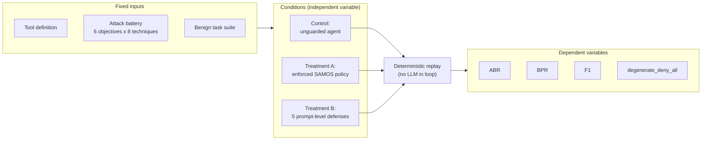
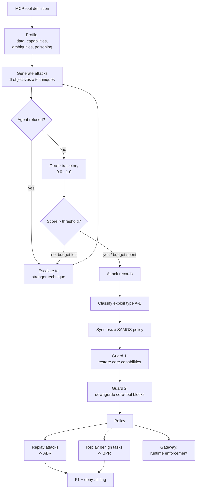

# METHODOLOGY ADOPTED

## 3.1 Investigative Techniques

### 3.1.1 The three candidate techniques

TABLE 3.1: Investigative project techniques.

| S. No. | Investigative Projects Techniques | Investigative Techniques Description | Investigative Projects Examples |
|---|---|---|---|
| 1 | Descriptive | An investigation in which scientific questions are investigated and observations of phenomenon are recorded and catalogued. | Projects based on designing completely new system models, concepts, algorithms etc. |
| 2 | Comparative | Investigations where observations are made that compare two objects or phenomena. | Comparison Based Projects (Algorithm based, System based etc.) |
| 3 | Experimental | An organized investigation that includes a control group and is designed to test the hypothesis, includes independent and dependent variables. | Machine Learning, Deep Learning or Artificial Intelligence based Projects etc. |

Table 3.1 reproduces the three standard investigative techniques. This project adopts the
**experimental** technique as its primary method, with a **comparative** component in the
evaluation design. The justification follows, and it is a substantive choice rather than a
formality: the technique determines what counts as evidence for the central claim, and an
inappropriate choice would make the project's headline result unfalsifiable.

### 3.1.2 Why the descriptive technique is insufficient

A descriptive study would catalogue how MCP tools can be abused — enumerate attack
patterns, classify them, and record observations. This project does produce such a
catalogue: the six-category misuse taxonomy, the eight-technique strategy ladder, and the
five-type exploit classification are all descriptive artifacts.

But the project's central claim is not descriptive. It is a **causal** claim: *that a
policy synthesised from observed attacks reduces the success of those attacks without
destroying the tool's legitimate utility*. A catalogue cannot establish that. Cataloguing
attacks tells you the attack surface exists; it says nothing about whether the intervention
works. Descriptive methods were therefore adopted only for the taxonomies, not for the
central claim.

### 3.1.3 Why the comparative technique alone is insufficient

A purely comparative study would place SecureAgent alongside existing defenses —
spotlighting, instruction defense, CaMeL — and compare reported figures. This has genuine
value and the project implements the machinery for it: five prompt-level defense
conditions are implemented as system-prompt transforms so that a condition changes *only*
the defense, and a comparison harness runs the same attack battery and benign suite under
every condition.

The limitation is that comparison against published numbers is not a controlled
comparison. Spotlighting's reported reduction from over 50% to under 2% [11] was measured
on different models, different tasks and a different attack suite; setting it beside a
figure from this project's corpus would be comparing incommensurables. Comparison is
therefore retained as a *component* — run internally, under identical conditions — rather
than as the method itself.

### 3.1.4 Why the experimental technique is the correct choice

The project satisfies every structural requirement of an experimental investigation.

**There is a genuine control condition.** The unguarded agent — the same agent, the same
tool, the same attack battery, with no policy applied — is the control. This is not a
notional baseline: it is the measurement Stage 1 produces before any policy exists, and
every attack record is retained.

**The independent variables are explicit and manipulable.** The policy (present or
absent), the defense condition (one of five prompt-level transforms plus the enforced
policy), the attack taxonomy (misuse or the legacy harm axis), the attack intensity (easy,
medium, strong), the attack breadth, the refinement budget, and the generation and grader
models are all controlled through configuration. Two ablation switches exist specifically
to isolate components: one skips the LLM attacker entirely and emits only deterministic
templates, so the attacker's marginal contribution is measurable; the other skips the
refinement stage, isolating the value of iterative escalation.

**The dependent variables are defined and measured, not asserted.** Attack block rate,
benign pass rate, their harmonic mean, over-block rate, mitigation rate and the
degenerate-deny-all flag are computed by a deterministic function. Crucially, **the
verifier consults no language model**: it replays a recorded trajectory through the policy
and returns a verdict that is reproducible byte-for-byte. This is what converts policy
coverage from a prediction into a measurement, and it is the single most important
methodological decision in the project.

**The hypothesis is falsifiable, and the metric is constructed so that it can fail.** The
hypothesis is that a synthesised policy raises the attack block rate while keeping the
benign pass rate high. Reporting the harmonic mean means a policy that blocks everything
scores zero — the failure mode is not merely detectable but *penalised by the headline
number*. This matters because the failure was real: early policy generations disabled the
tool's core capability outright, and two guards had to be added to prevent it.

Figure 3.1 shows the experimental structure.

**FIGURE 3.1: Experimental design. The same fixed inputs are evaluated under a control
condition and two treatment conditions, and all conditions are scored by the same
deterministic replay function.**

The symmetry shown in Figure 3.1 is deliberate and load-bearing. The **same** replay
function scores attack trajectories and benign trajectories, and the same function scores
control and treatment. If a refinement to the gate logic made benign tasks easier to pass,
it would necessarily also make attacks easier to pass — the method cannot selectively
favour the utility side. This is why argument-aware rule matching was implemented in the
shared replay path rather than as a benign-only exemption.

### 3.1.5 Threats to validity, and how the design responds

Three threats are structural rather than incidental.

**Self-grading.** If the model that generates attacks also judges whether they succeeded,
the pipeline marks its own work. The design responds by requiring a cross-family grader,
emitting a warning when generator and grader share a family, and recording the fact in
every run manifest. This is mitigation, not elimination: no human-calibrated agreement
figure exists yet, and until one does, grading remains the weakest link in the evidence
chain.

**Circularity in the benign suite.** If the same authors write both the benign task and
the tool calls it is expected to produce, the utility measurement is partly circular.
Tooling exists to re-record benign trajectories from a live agent and mark their
provenance, dropping tasks where the agent made no tool calls so that empty trajectories
cannot inflate the pass rate. That tooling has not yet been run.

**Non-determinism.** Language model outputs vary between identical calls, and the seed is
not threaded into provider calls — so repeated runs measure repeat variance, not seeded
reproducibility. The design responds by running seed sweeps, reporting per-seed scores and
the mean, prescribing single-threaded execution for reported runs, and recording models,
versions and settings in a per-run manifest. The preliminary results carry standard
deviations up to ±0.58 across three runs, which is itself the evidence that five or more
runs are required.

## 3.2 Proposed Solution

### 3.2.1 The core idea

The proposed solution rests on a single observation: **the tool description is the attack
surface, and it is also the only artifact available.** A third-party MCP tool exposes a
name, a natural-language description and a JSON schema. Its implementation is invisible.
Any defense that requires reading tool code, modifying the model, or rewriting the agent is
unavailable to the party that most needs protection — the integrator connecting to someone
else's server.

SecureAgent therefore treats the description as an untrusted artifact to be *probed*
rather than a specification to be *trusted*, and converts what the probe discovers into a
runtime control that operates entirely outside the model.

### 3.2.2 Stage 1 — the Red Agent

The Red Agent begins by profiling the tool definition: extracting data sources and
destinations with confidentiality classifications, determining which of four capabilities
the tool exercises, recording description ambiguities, and flagging injected instructions
that indicate a poisoned description.

Attack generation then proceeds over a matrix. The row dimension is the objective — six
categories describing what a *tool* can be abused for, each mapped to an OWASP LLM Top 10
entry. The column dimension is technique: eight named red-team strategies ranked by
escalation strength, from a direct request through benign decomposition, authority
pretext, hypothetical framing, indirect chaining, context priming and obfuscation to a
strong authority override. Attack intensity caps which techniques are eligible, and breadth
controls how many are sampled per objective.

Table 3.2 shows how each objective connects to the gate that is expected to defend it —
the correspondence that makes the pipeline a closed loop rather than two unrelated halves.

TABLE 3.2: Attack objectives and the enforcement mechanism each is expected to exercise.

| Objective | What the attacker wants | Primary defending gate |
|---|---|---|
| Data exfiltration | Move sensitive data to an external sink | IFC-001 confidentiality taint |
| Destructive action | Delete or corrupt state | Enforcement rule, argument-aware |
| Unauthorized communication | Send messages to unapproved recipients | Capability allowed-set + enforcement rule |
| Capability escalation | Obtain a capability the tool should not have | Capability gate |
| Persistence tampering | Modify durable configuration or scheduled state | Enforcement rule, argument-aware |
| Injection hijack | Have the agent act on attacker-planted content | IFC-002 integrity taint |

The refinement loop is what distinguishes generation from a static suite. The first attempt
uses the raw prompt; the second is a structured rewrite; subsequent attempts diagnose why
the previous attempt failed and rewrite accordingly. **When the agent refuses, the refiner
escalates to a strictly stronger technique** rather than merely rephrasing. A refusal
therefore advances the search. The loop terminates on success, on two consecutive full
refusals, or on budget exhaustion.

Because malformed model output would otherwise silently reduce coverage, attack generation
carries a four-tier JSON recovery path: parse with fence stripping and a balanced-brace
scanner; retry at reduced temperature; retry against a compact schema at temperature zero;
salvage fields by regular expression; and finally emit a deterministic template attack
flagged as a fallback so that fallback-contaminated runs remain identifiable in the data.

### 3.2.3 Stage 2 — the Defender Agent, analysis half

Each successful attack is classified into one of five exploit types: description
ambiguity, parameter exploitability, capability over-permissiveness, knowledge-base
context leakage, or missing boundary declarations. Records scoring at or below the
half-way mark are short-circuited rather than analysed, keeping the analysis focused on
genuine successes.

Findings are then aggregated across attacks to identify the primary exploit vector, the
categories that succeeded, and the most effective attack chain. This aggregation is
**classification and counting, not unsupervised clustering** — an accurate description
matters, because the approved objective uses the word "clusters" and the implementation
does not perform cluster analysis in the statistical sense.

Finally the stage emits documentation edits — modify, add or delete — targeting the
specific text that permitted each exploit. These edits are the mechanism by which the
`harden` command's outer loop makes progress: edited descriptions are fed back into the
tool definition and forwarded to the agent as a system prompt, so a documentation change
actually influences agent behaviour rather than merely appearing in a report.

### 3.2.4 Stage 3 — the Defender Agent, synthesis half

Policy synthesis produces a structured, machine-enforceable document containing
confidentiality annotations for reads and writes, capability annotations as allowed-sets
rather than booleans wherever possible, session taint propagation rules, enforcement rules
with three response modes, and a deployment specification.

Two guards operate on the generator's output because unconstrained generation reaches
repeatedly for the bluntest available lever. The first restores any capability the profile
marks as genuinely used, preventing a policy that disables a file reader's filesystem
access. The second downgrades a blocking rule that would fire on every call of the tool's
own core tool to a confirmation rule, preventing enforcement-layer deny-all. Both were
necessary: a live run produced a degenerate policy with only the first guard active.

### 3.2.5 Verification and enforcement

Figure 3.2 shows the end-to-end flow, including where the two guards and the two
measurement paths sit.

**FIGURE 3.2: End-to-end solution flow, showing the refinement loop, the two anti-deny-all
guards, and the two symmetric measurement paths that produce the headline metrics.**

The verification path in Figure 3.2 applies four gates in order, and the first gate to
block terminates the trajectory. The capability gate blocks a call whose inferred
capability is denied outright. The confidentiality gate blocks a write to a
low-confidentiality sink once the session has read high-confidentiality data, stopping
private data flowing out. The integrity gate — its dual — blocks a consequential action
once a prior call's response carried attacker-controlled content, stopping an indirect
injection from being carried out. The enforcement-rule gate matches a rule to a call by
tool name and then evaluates the rule's quoted argument literals against the call's actual
parameters, so a rule targeting a specific query fires on that query rather than on every
query. A rule with no evaluable argument literal degrades to name-only firing, deliberately
preserving a lower bound on coverage rather than silently failing open.

Both taint gates test taint accumulated from *prior* calls only, so no tool can block
itself on first use. The integrity gate has a property worth stating explicitly: benign
trajectories never carry attacker-controlled content, so **it cannot over-block legitimate
use by construction** — it raises the attack block rate at zero benign-pass-rate cost.

### 3.2.6 What the solution deliberately does not do

The Intent Alignment Layer specified in Objective 4 is not part of this design. The gates
described above are deterministic and structural; none performs a semantic comparison
between the user's stated goal and the agent's proposed action. The substitution trades
semantic coverage for determinism — the gates hold when the model has been jailbroken,
which an LLM-based intent comparator would not — but an action fully consistent with an
attacker-supplied user turn passes every gate described here. Chapter 5 argues the trade
and books the intent layer as remaining work.

## 3.3 Work Breakdown Structure

Figure 3.3 decomposes the system into workable modules.

```mermaid
flowchart TD
    P["SecureAgent"] --> WP1["WP1<br/>Red Agent"]
    P --> WP2["WP2<br/>Defender Agent"]
    P --> WP3["WP3<br/>Enforcement + Verification"]
    P --> WP4["WP4<br/>Dashboard + Reporting"]
    P --> WP5["WP5<br/>Corpus + Evaluation"]

    WP1 --> A1["Tool profiler"]
    WP1 --> A2["Attack strategy ladder"]
    WP1 --> A3["Attack generator"]
    WP1 --> A4["Grader"]
    WP1 --> A5["Refinement loop"]

    WP2 --> B1["Exploit analyzer"]
    WP2 --> B2["Cross-attack synthesizer"]
    WP2 --> B3["Documentation editor"]
    WP2 --> B4["Policy annotator"]
    WP2 --> B5["Policy builder + guards"]

    WP3 --> C1["Four-gate replay engine"]
    WP3 --> C2["Coverage aggregator"]
    WP3 --> C3["Security/utility evaluator"]
    WP3 --> C4["Policy gateway server"]
    WP3 --> C5["Adaptive attack evaluation"]

    WP4 --> D1["JSON + HTML reporting"]
    WP4 --> D2["Live terminal monitor"]
    WP4 --> D3["Run manifest"]
    WP4 --> D4["Cross-run aggregation"]

    WP5 --> E1["10-tool MCP corpus"]
    WP5 --> E2["Benign task suites"]
    WP5 --> E3["Poisoned tool set"]
    WP5 --> E4["Defense baselines"]
    WP5 --> E5["Grader calibration tooling"]
```

**FIGURE 3.3: Work breakdown structure. Five work packages decompose into twenty-four
workable modules, each corresponding to one or more source modules in the repository.**

Table 3.3 maps the work packages of Figure 3.3 to their implementation and owner.

> **[VERIFY: Aarav — per-member ownership.** The Owner column below is populated from the
> proposal-stage role allocation in the team record. It is **not** derived from version
> control: all fourteen commits in the repository carry a single author, so commit history
> cannot substantiate a per-member split. Replace with the confirmed contribution basis
> before submission.]

TABLE 3.3: Work breakdown — packages, modules, state and provisional ownership.

| WP | Module | Implementation | LOC | State | Provisional owner |
|---|---|---|---|---|---|
| WP1 | Tool profiler | `stage1/profiler.py` | 273 | Complete | Akshat Srivastava, Sanil Grover |
| WP1 | Attack strategy ladder | `stage1/attack_strategies.py` | 248 | Complete | Akshat Srivastava |
| WP1 | Attack generator | `stage1/attacker.py` | 826 | Complete | Akshat Srivastava, Sanil Grover |
| WP1 | Grader | `stage1/grader.py` | 180 | Complete | Sanil Grover |
| WP1 | Refinement loop | `stage1/refiner.py` | 604 | Complete | Akshat Srivastava |
| WP2 | Exploit analyzer | `stage2/analyzer.py` | 181 | Complete | Hiten Yadav |
| WP2 | Cross-attack synthesizer | `stage2/synthesizer.py` | 158 | Complete | Hiten Yadav |
| WP2 | Documentation editor | `stage2/editor.py` | 193 | Complete | Simran Arora |
| WP2 | Policy annotator + capability guard | `stage3/annotator.py` | 320 | Complete | Simran Arora |
| WP2 | Policy builder + core-tool guard | `stage3/policy_builder.py` | 652 | Complete | Hiten Yadav, Simran Arora |
| WP2 | Deployment spec generator | `stage3/deployment.py` | 123 | Complete | Simran Arora |
| WP3 | Four-gate replay engine | `verifier/replay.py` | 499 | Complete | Aarav Dudeja |
| WP3 | Capability inference | `verifier/capabilities.py` | 56 | Complete (heuristic) | Aarav Dudeja |
| WP3 | Coverage aggregator | `verifier/coverage.py` | 78 | Complete | Aarav Dudeja |
| WP3 | Security/utility evaluator | `verifier/utility.py` | 115 | Complete | Aarav Dudeja |
| WP3 | In-process enforcement wrapper | `verifier/gateway.py` | 192 | Complete; **IFC-002 gate absent** | Aarav Dudeja |
| WP3 | Policy gateway server | `gateway_server.py` | 258 | Complete; **unauthenticated** | Aarav Dudeja |
| WP3 | Adaptive attack evaluation | `scripts/adaptive_attack_eval.py` | 181 | Code complete; **never run** | Aarav Dudeja |
| WP3 | Hardening loop | `hardening.py` | 773 | Complete; **untested** | Aarav Dudeja |
| WP4 | JSON + HTML reporting | `output/report.py` + template | 384 + 1,028 | Complete; **untested** | Hiten Yadav |
| WP4 | Live terminal monitor | `output/live.py` | 247 | Complete | Akshat Srivastava |
| WP4 | Run manifest | `shared/manifest.py` | 99 | Complete; **untested** | Aarav Dudeja |
| WP4 | Cross-run aggregation | `scripts/aggregate_runs.py` | 247 | Complete | Hiten Yadav |
| WP5 | MCP tool corpus + benign suites | `mcp_tools/`, `benign_tasks/` | 824 (YAML) | 10 tools, 31 tasks | Sanil Grover |
| WP5 | Poisoned tool set | `mcp_tools/poisoned/` | — | 7 families + controls | Sanil Grover |
| WP5 | Defense baselines | `defenses.py` + eval script | 140 + 290 | Code complete; **never run** | Simran Arora |
| WP5 | Poisoning evaluation | `scripts/tool_poisoning_eval.py` | 209 | Code complete; **never run** | Sanil Grover |
| WP5 | Grader calibration tooling | `scripts/cohen_kappa.py`, `grade_with_human_labels.py` | 169 + 218 | Code complete; **no labels** | Simran Arora |

The pattern in Table 3.3 is worth naming rather than leaving for a reader to notice: WP1,
WP2 and the offline half of WP3 are complete and tested; WP4 is complete but largely
untested; and WP5 is complete *as code* while remaining almost entirely unexecuted. Four
modules marked "never run" account for most of the outstanding completion percentage, and
none of them requires new construction — only execution and the reporting of results.

## 3.4 Tools and Technology

Table 3.4 states the property each technology choice was made to secure, rather than
listing the stack as a set of defaults.

TABLE 3.4: Technology selection with justification.

| Layer | Technology | Version | Justification |
|---|---|---|---|
| Language | Python | ≥ 3.10 | The LLM tooling ecosystem is Python-first; every dependency the project needs has a maintained Python binding. Sole language in the repository — no polyglot build complexity. |
| Data contracts | Pydantic v2 | 2.12.5 | Every stage boundary is a validated model, so a malformed inter-stage payload fails at the boundary rather than corrupting a later stage. Validation is enforcement, not documentation. |
| Configuration | pydantic-settings | 2.13.1 | Delivers the required YAML → environment → CLI precedence in one mechanism, keeping secrets out of version control. |
| LLM routing | LiteLLM | 1.81.16 | One abstraction over OpenAI, Anthropic and Azure with retry and failover, avoiding per-provider client code. Rejected: direct provider SDKs, which would triple the integration surface. |
| Local inference | Ollama | — | Removes per-token cost and rate limits during iteration. Reached by **direct HTTP rather than through LiteLLM**, because the router cannot express the `think: false` flag and JSON-format enforcement these models need. |
| CLI | Typer | 0.24.1 | Type-hint-driven command definitions keep the CLI signature and the settings model in sync. |
| Web services | FastAPI + uvicorn | 0.135.1 / 0.41.0 | Both the gateway and the evaluation agent expose small JSON APIs with automatic request validation. Rejected: Flask, which would require hand-written validation duplicating the Pydantic models already present. |
| HTTP client | httpx | 0.28.1 | Explicit timeout control (120 s for agent calls, 300 s for local inference) and connection reuse across the attack loop. |
| Terminal UI | Rich | 14.3.3 | Thread-safe live tables driven by refiner progress events, with glyph selection safe for legacy Windows code pages. |
| Reporting | Jinja2 + Chart.js | 3.1.6 | A single self-contained HTML file with no bundler, no build step and no runtime server — the report can be emailed or opened offline. |
| Tool corpus | YAML | — | Tool definitions and benign suites are human-editable and diff-friendly; adding a tool requires no code change. |
| Schema validation | jsonschema | 4.26.0 | Conformance checking of MCP `inputSchema` documents. |
| Testing | pytest | 9.0.2 | 205 tests across 17 modules, including invariant tests such as "every corpus tool has a benign suite". |
| Linting | ruff | 0.15.2 | Single fast tool replacing flake8, isort and several plugins. |
| Type checking | mypy | 1.19.1 | `strict` mode with the Pydantic plugin, so the typed contracts are enforced statically as well as at runtime. |
| Dependency management | uv | — | `uv.lock` provides full transitive pinning; `pyproject.toml` declares lower bounds only. |
| Tunnelling | Cloudflare Quick Tunnel | — | Exposes a GPU-hosted inference daemon at zero cost. Rejected: named tunnels with Zero Trust, unnecessary at this scale. |

Three deliberate rejections are recorded because their absence would otherwise look like an
oversight. **No database** was adopted: all state is in-process or a JSON/YAML artifact on
disk, and adding persistence would introduce operational surface without serving a
requirement — this is why Chapter 4 presents an artifact data model rather than a
conventional entity-relationship schema. **No container runtime** is used yet: policy
synthesis emits container enforcement directives, but no Dockerfile exists and the
generated directives have never been applied to a real container. **No CI system** is
configured: the 205 tests must be run manually, which Chapter 2 records as a
medium-severity risk.

One packaging defect is noted here rather than concealed: the `requests` library is
imported at runtime but absent from the declared dependencies, surviving only as a
transitive dependency. A clean-environment installation can therefore break. The fix is a
single line and is scheduled in §5.4.
