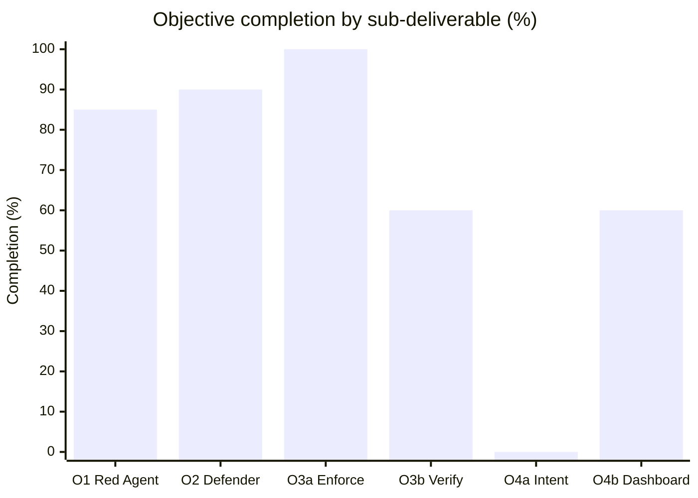
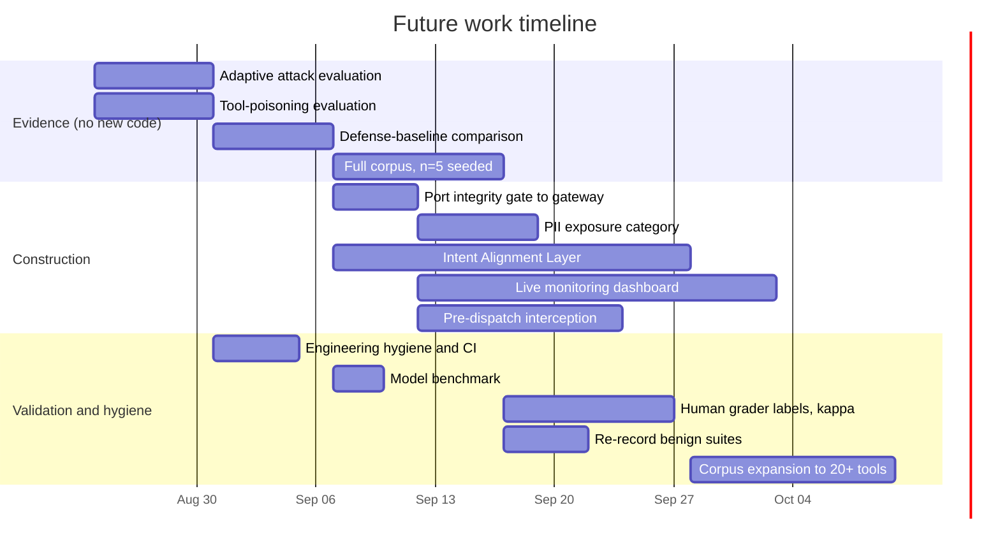

# CONCLUSIONS AND FUTURE SCOPE

## 5.1 Work Accomplished

Progress is reported against the four objectives approved at Proposal Evaluation, quoted
verbatim in §1.7. Objectives 3 and 4 are compound, so completion is reported per
sub-deliverable and then rolled up, in accordance with the proposal's own instruction.

Table 5.1 reports completion per sub-deliverable together with the principal evidence
supporting each figure.

TABLE 5.1: Work accomplished against the approved objectives.

| Obj | Sub-deliverable | Status | % | Principal evidence |
|---|---|---|---|---|
| O1 | Red Agent — schema-aware adversarial attack generation | Substantially complete | 85% | `stage1/`: profiler, attacker, 8-technique ladder, grader, refiner with escalation-on-refusal; 6 misuse objectives; direct and indirect delivery channels |
| O2 | Defender Agent — analysis, pattern aggregation, policy synthesis | Substantially complete | 90% | `stage2/` 5-type exploit taxonomy + cross-attack aggregation; `stage3/` `SAMOSPolicy` as validated JSON with human-readable HTML rendering |
| O3a | Policy Enforcement Engine, three response modes | Complete | 100% | `EnforcementAction` = BLOCK / REQUIRE_CONFIRMATION / AUDIT, enforced by the four-gate replay engine and the FastAPI gateway |
| O3b | Policy Verification Loop — re-run attacks post-policy | Partial | 60% | Deterministic replay complete and tested; live re-run harness complete but **never executed** |
| **O3** | **rolled up** | **Substantially complete** | **80%** | |
| O4a | Intent Alignment Layer — semantic goal vs. action comparison | **Not delivered as specified** | 0% | No such component exists |
| O4b | Security Dashboard — risk scores, policies, vulnerability history | Partial | 60% | Chart.js HTML report with risk scores, active policy, findings and per-record verdicts; static per-run artifact, not live monitoring |
| **O4** | **rolled up** | **Partial** | **30%** | |

**Weighted completion across the four approved objectives: 71%** — (85 + 90 + 80 + 30) / 4
= 71.25%. Figure 5.1 shows the distribution.

**FIGURE 5.1: Completion by sub-deliverable. The two zero-and-partial bars on the right are
Objective 4, which accounts for most of the shortfall against the approved proposal.**

Figure 5.1 makes the shape of the remaining work plain: five of six sub-deliverables are at
60% or above, and the deficit is concentrated in Objective 4. What follows discusses each
divergence rather than restating the percentages.

### 5.1.1 What was built and works

The Red Agent and Defender Agent together constitute a working pipeline of 9,397 lines of
library code covered by 205 tests. The attack side generates schema-aware attacks across six
tool-misuse objectives and eight ranked techniques, and — importantly — treats a refusal as a
signal to escalate rather than as a terminal outcome. The defense side classifies every
success into a five-type exploit taxonomy, aggregates across attacks to identify the primary
exploit vector, and synthesises a structured policy that a runtime component can load and
enforce without further interpretation.

The Policy Enforcement Engine is complete. Three response modes are implemented and applied
by a four-gate deterministic replay engine, and the same gate logic is exposed as a FastAPI
gateway that sits in front of an unmodified agent. That the verifier consults **no language
model** is the most consequential engineering decision in the project: it makes policy
coverage a measurement rather than a prediction, and every per-record verdict ships in the
report so a reviewer can audit each figure independently.

The preliminary evaluation is genuine but explicitly not final. Table 5.2 reproduces it with
its caveats intact.

TABLE 5.2: Preliminary corpus results — cross-run mean ± standard deviation, n = 3
independent runs over all ten corpus tools.

| Tool | F1 (mean ± std) | ABR (mean ± std) | BPR (mean ± std) |
|---|---|---|---|
| list_directory | 0.84 ± 0.17 | 0.75 ± 0.25 | 1.00 ± 0.00 |
| database_query | 0.70 ± 0.30 | 0.65 ± 0.38 | 0.89 ± 0.19 |
| execute_command | 0.62 ± 0.20 | 0.47 ± 0.21 | 1.00 ± 0.00 |
| write_file | 0.60 ± 0.53 | 0.56 ± 0.51 | 1.00 ± 0.00 |
| read_file | 0.33 ± 0.58 | 0.33 ± 0.58 | 1.00 ± 0.00 |
| send_email | 0.22 ± 0.38 | 0.50 ± 0.50 | 0.67 ± 0.58 |
| web_search | 0.22 ± 0.38 | 0.17 ± 0.29 | 1.00 ± 0.00 |
| manage_calendar | 0.15 ± 0.26 | 0.11 ± 0.19 | 0.89 ± 0.19 |
| post_message | 0.11 ± 0.19 | 0.07 ± 0.12 | 1.00 ± 0.00 |
| http_request | 0.00 ± 0.00 | 0.00 ± 0.00 | 1.00 ± 0.00 |
| **Corpus aggregate** | **0.380** | — | **0.944** |

> **These are not final numbers.** They were produced with `n_repeats = 1` per run and
> `max_iterations = 2`, which makes per-tool attack counts small and the estimates noisy —
> several standard deviations in Table 5.2 exceed ±0.5. Reproduction with at least five
> seeded runs, single-threaded execution and a fixed seed is required before any of these
> figures is quoted as a result.

Read with that caveat, Table 5.2 supports exactly one robust claim: **the benign pass rate
averages 0.94 and is 1.00 with zero variance on seven of ten tools, and no policy in any run
was flagged degenerate.** The utility side of the tradeoff holds run to run. The security
side is non-trivial on the argument- and flow-based tools — `list_directory`,
`database_query`, `execute_command`, `write_file` — and weak elsewhere, with variance too
wide to rank tools against one another. The single tool at F1 = 0.00 with zero variance
(`http_request`) is not a gate failure but an absence of successful attacks to block in
those runs.

### 5.1.2 Divergences from the approved proposal

Three divergences are material and are stated here rather than left for the panel to find.

**Objective 1 — PII exposure has no distinct coverage.** Three of the four named risk
categories map cleanly onto the implemented misuse taxonomy: data leakage to
`data_exfiltration`, privilege escalation to `capability_escalation`, and unauthorized
modification to `destructive_action` and `persistence_tampering`. PII exposure was folded
into `data_exfiltration` during refinement and does not survive as a separately generated,
separately reported category; a search of the source tree for PII-related identifiers
returns no matches. The consequence is that the system cannot currently report a
PII-specific finding, which the objective asks for. Restoring it is a bounded change — a
seventh objective category with its own grading criteria — and is scheduled in §5.4.

**Objective 3 — the verification loop is built but unevidenced.** Both halves exist:
deterministic offline replay, and a live harness that re-runs the attack battery against a
policy-guarded agent and reports risk reduction with bootstrap confidence intervals. The
latter has never been executed. The objective asks for a loop "that confirms risk reduction",
and confirmation requires a number. **No measured risk-reduction figure exists**, which makes
this the highest-value outstanding experiment in the project: the code is written, the corpus
is in place, and the result is one execution away.

**Objective 4 — the Intent Alignment Layer was not built.** This is the largest gap and it
was an architectural decision rather than an oversight. The approved design proposed catching
divergence between the user's goal and the agent's proposed action by semantic comparison.
The refined architecture instead pursues the consequential subset of that goal
deterministically: the integrity gate blocks a consequential action once the session has
ingested attacker-controlled content — precisely the case where the action originates from
something other than the user's intent — and argument-aware enforcement rules discriminate
malicious from benign calls on parameter values rather than tool identity.

The trade is real and runs in both directions. Deterministic gates **hold when the model has
been jailbroken**, which an LLM-based intent comparator would not; that independence from
model compliance is the property this project can defend against a prompt-level baseline. But
the substitution **loses semantic coverage**: an action fully consistent with an
attacker-supplied *user turn* passes every implemented gate, and that is exactly the case an
intent layer would catch. Neither mechanism performs the semantic comparison the objective
specifies, and this report does not present the gates as satisfying Objective 4a.

**Objective 4 — the dashboard is a report, not a monitor.** The HTML dashboard presents risk
scores, the active policy and the vulnerability findings, which is most of what the objective
asks for. What is missing is the monitoring character: it is generated per run and read
offline, cross-run vulnerability history exists only as aggregated CSV, and the gateway's
audit endpoint returns JSON with no interface over it.

### 5.1.3 Known open defects

Four defects are recorded rather than deferred, because each is discoverable by a panel
reading the code.

1. **Gate asymmetry.** The integrity gate is implemented in the offline verifier but not in
   the live enforcement wrapper, so measured coverage and live enforcement do not implement
   the same policy. Measured figures are therefore an upper bound on live behaviour.
2. **Unauthenticated endpoints.** None of the three HTTP servers authenticates its own
   endpoints; the gateway only forwards a bearer token to the inner agent. Acceptable for
   local research use, blocking for any production deployment.
3. **Grader heuristic can outrank the judge.** The final score is the maximum of the model
   judge's score and a deterministic heuristic that reaches 0.96, above the default 0.95
   threshold — so an attack can be recorded as successful without the judge agreeing.
   Reporting runs use a threshold of 0.8 so the rubric governs, but no test covers the
   interaction.
4. **Undeclared dependency.** A library imported at runtime is absent from the declared
   dependencies and survives only transitively, so a clean-environment install can break.

## 5.2 Conclusions

**The central technical claim is supported, with one qualification.** A policy synthesised
from observed attacks can be enforced deterministically at the tool-dispatch boundary without
modifying the agent, and — critically — without destroying the tool's legitimate utility. The
benign pass rate of 0.94 across ten tools, stable at 1.00 on seven of them, is the strongest
result the project currently has, and it is the result that matters most, because it is the
one an over-blocking defense would fail. The qualification is that the security side of the
tradeoff is measured with n = 3 and standard deviations that in several cases exceed ±0.5;
those figures indicate a working mechanism, not a quantified level of protection.

**Making the metric un-gameable was the decision that made the project meaningful.** Attack
block rate in isolation is trivially maximised by disabling the tool. Reporting the harmonic
mean of block rate and benign pass rate means a deny-all policy scores zero, and the two
generator-side guards exist because that degenerate policy was produced repeatedly during
development — the failure was observed, not anticipated. Without this construction the
project would have been able to report a perfect security score for a useless system.

**Determinism in the verifier is what converts a claim into a measurement.** Because the
replay engine consults no language model, every coverage figure is reproducible and every
per-record verdict is auditable. This is also what makes the honest comparison against
prompt-level defenses possible: the defensible claim is not that policy enforcement blocks
more than spotlighting, but that it holds when the model has already complied.

**The project's position relative to the strongest prior art is narrow and should stay
narrow.** CaMeL provides stronger, construction-based guarantees, and this work does not
claim to beat it on security. What it offers is a different operating point: no agent
rewrite, automatic per-tool synthesis, and a threat model in which the tool description
itself is untrusted. For an integrator connecting to a third-party MCP server — who can
modify neither the model nor the agent — that operating point is the only one available.

**The work remaining is unevenly distributed, and honestly so.** Five of six
sub-deliverables sit at 60% or above; the deficit is concentrated in Objective 4. Most of
what remains is execution and evidence rather than construction: four evaluation scripts are
written and unrun, and no human grader labels have been collected. The exception is the
Intent Alignment Layer, which is genuine new construction and which the project must either
build or justify having replaced.

## 5.3 Environmental, Economic and Social Benefits

**Environmental.** The full evaluation protocol — fifty pipeline runs across the ten-tool
corpus — consumes approximately 20.8 GPU-hours, or about 14.6 kWh on an owned GPU. That is a
deliberately small footprint for a machine-learning project, achieved by three design
choices: local inference through quantised models rather than repeated hosted-API calls, a
verifier that consults no model at all, and simulated rather than real tool execution.
Because the verification layer is deterministic, re-measuring a policy costs no inference at
all — an entire category of repeated computation is eliminated rather than optimised.

**Economic.** Three configurations were costed in §2.3. Running entirely on an owned GPU
costs approximately **₹786** for the full protocol including a month of gateway hosting, or
about ₹117 excluding hosting. A hosted-API configuration costs approximately **₹4,756**, and
the recommended hybrid — local generation with an independent hosted grader — costs
approximately **₹1,612** while removing the self-grading validity objection. Two findings
generalise beyond this project: the generation model choice, not the run count, dominates the
bill, and the target agent's own reasoning calls account for roughly 56% of all model calls —
the line most often omitted from an agent-evaluation budget.

The broader economic argument is deployment cost. A defense requiring an agent rewrite
carries an engineering cost measured in weeks; a gateway that wraps an existing endpoint
carries one measured in minutes. For organisations integrating third-party tools, that
difference determines whether any control is adopted at all.

**Social.** As agents acquire the ability to read files, send messages and execute commands
on people's behalf, the consequences of a successful injection stop being reputational and
become material — data exposure, unauthorised communication, destroyed state. The published
attack success rates against real MCP servers are high enough that this is a present risk
rather than a projected one. Work that lowers the cost of deploying a meaningful control
widens the set of organisations that can offer agentic features safely, rather than
restricting safe agents to those with the engineering capacity to rebuild their runtime.

Two limitations belong in this section rather than being claimed as benefits. The system
does not make an agent safe; it constrains one tool's attack surface, and coverage is
measured rather than proven. And the policies it generates are authored by a language model
and may be over-broad — the utility metric exists precisely because that risk is real.

## 5.4 Future Work Plan

Work is ordered by value per unit of effort. The first three items require no new
construction: the code exists and has never been executed, so each converts an unevidenced
claim into a measured one.

Table 5.3 orders the remaining work by value per unit of effort, and Figure 5.2 places it
on a timeline.

TABLE 5.3: Future work plan.

| # | Work item | Objective served | Effort | Depends on | Target |
|---|---|---|---|---|---|
| 1 | Execute the adaptive-attack evaluation: same battery, unguarded vs. policy-guarded, with bootstrap CIs | **O3b** | Low — script complete | Corpus, a generated policy | Week 1 |
| 2 | Execute the tool-poisoning evaluation over 7 poisoned tools and matched clean controls; report recall, FPR, precision, per-family recall | O1 | Low — script complete | — | Week 1 |
| 3 | Execute the defense-baseline comparison: policy vs. spotlighting, instruction defense, sandwich, sink restriction under identical conditions | O3b | Low — script complete | Item 1 | Week 2 |
| 4 | Re-run the full corpus with `--n-repeats 5`, single-threaded, fixed seed; replace all preliminary figures with mean ± std | O1, O3b | Medium — compute time | Items 1–3 | Weeks 2–3 |
| 5 | **Implement the Intent Alignment Layer**: semantic comparison of the user's stated goal against each proposed tool call, inserted pre-dispatch | **O4a** | **High — new construction** | Design decision on model vs. rule-based comparison | Weeks 3–6 |
| 6 | Port the integrity gate into the live enforcement wrapper so offline coverage and live enforcement implement the same policy | O3a | Low | — | Week 3 |
| 7 | Add a distinct PII-exposure attack category with its own generation and grading criteria | **O1** | Medium | — | Week 4 |
| 8 | Extend the dashboard into a live monitoring interface: cross-run vulnerability history, active-policy view, audit stream over the gateway's audit endpoint | **O4b** | Medium–High | Item 6 | Weeks 4–7 |
| 9 | Collect human labels on a stratified subset of at least 40 trajectories; report Cohen's κ against the model judge | O1, O2 | Medium — human time | Item 4 | Weeks 4–5 |
| 10 | Re-record benign task suites from the live agent and re-run the utility numbers with recorded provenance | O3b | Low — script complete | Item 4 | Week 5 |
| 11 | Move the gateway from post-hoc truncation to pre-dispatch interception | O3a | Medium | Item 6 | Weeks 5–6 |
| 12 | Add authentication to all gateway endpoints | O3a | Low | — | Week 5 |
| 13 | Expand the corpus from 10 self-authored tools to 20+ drawn from a public MCP registry | O1 | Medium | — | Weeks 6–7 |
| 14 | Engineering hygiene: declare the missing runtime dependency, add CI running the 205 tests plus lint and type checks, add a test for the grader-heuristic interaction | all | Low | — | Week 2 |
| 15 | Run the model benchmark and record measured latency and throughput, replacing the extrapolated wall-clock assumption | — | Low — script complete | — | Week 3 |

**FIGURE 5.2: Future work timeline. The evidence track requires no new code and closes most
of the gap on Objectives 1 and 3; the construction track addresses Objective 4, which is the
only genuine new build remaining.**

The two tracks in Figure 5.2 are deliberately parallel because they have different risk
profiles. The evidence track is low-risk and high-value — every item is an execution of
complete code, and together items 1 through 4 convert Objective 3b from 60% to complete and
materially strengthen Objective 1. The construction track carries the real schedule risk: the
Intent Alignment Layer is three weeks of new work with an unresolved design decision at its
head, namely whether the semantic comparison should itself use a language model — reintroducing
the dependence on model compliance that the deterministic gates were chosen to avoid — or a
rule-based approximation with narrower coverage. That decision should be taken with the
mentors before implementation begins, since it determines whether the resulting layer
strengthens the system's guarantees or merely broadens them.
