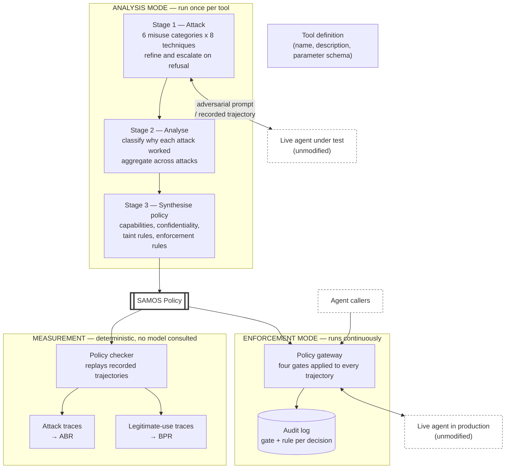
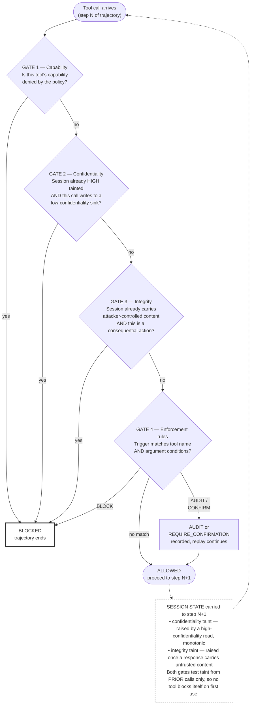
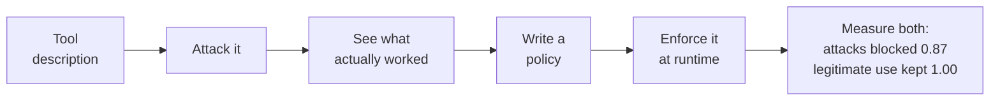

# Report Diagrams — Mermaid Source

Two diagrams go into Chapter 4. Render each to PNG, then paste into the matching
dashed frame in the .docx.

## How to render

**Option A — mermaid.live (easiest, no install).**
1. Open <https://mermaid.live>
2. Paste the code block below into the left pane.
3. Set a light theme (Actions → Config → `"theme": "neutral"`) so it prints well.
4. **Actions → PNG** → choose *3x* scale. A 1x export looks blurry in Word.
5. Paste into the .docx frame.

**Option B — command line (sharper, repeatable).**
```bash
npm install -g @mermaid-js/mermaid-cli
mmdc -i fig41.mmd -o fig41.png -t neutral -b white -s 3
mmdc -i fig42.mmd -o fig42.png -t neutral -b white -s 3
```
Save each code block below into `fig41.mmd` / `fig42.mmd` first (without the
surrounding markdown fence).

**Print settings that matter:** white background (`-b white`), `neutral` theme,
scale 3. The report is printed in colour, but the diagrams must still be legible
in greyscale, so the shading below relies on outline weight rather than hue.

---

## FIGURE 4.1 — System Architecture

Goes in **Chapter 4, section 4.1**, replacing `*[SCREENSHOT: block diagram]*`.

Shows the two operating modes sharing one policy. The point a reader should take
away: the policy is the only artefact that crosses from analysis to enforcement,
and the agent is untouched in both modes.



**Caption to keep:** *FIGURE 4.1: System architecture — analysis mode produces a
policy, enforcement mode applies it.*

---

## FIGURE 4.2 — The Four Enforcement Gates

Goes in **Chapter 4, section 4.2**, replacing `*[SCREENSHOT: gate flow diagram]*`.

Shows gate order and the taint state carried between calls. Two things a reader
should take away: the gates are ordered from unconditional to most specific, and
both taint gates test taint accumulated from *prior* calls, which is what stops a
tool blocking itself on its first use.



**Caption to keep:** *FIGURE 4.2: The four enforcement gates in order, with the
taint state carried between calls.*

---

## Optional — pipeline overview for the slides

Not a numbered report figure. Useful on a single slide if you present.


